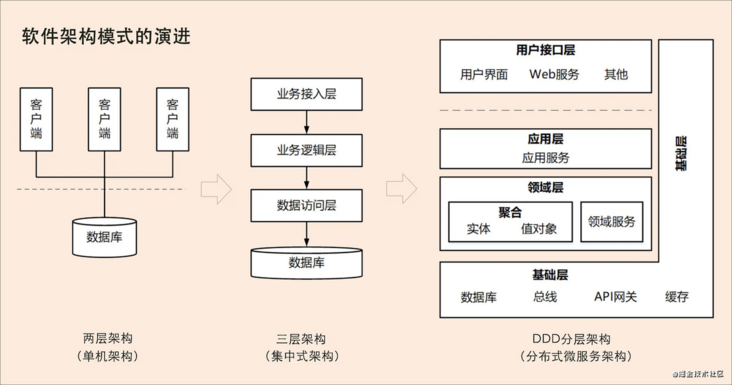
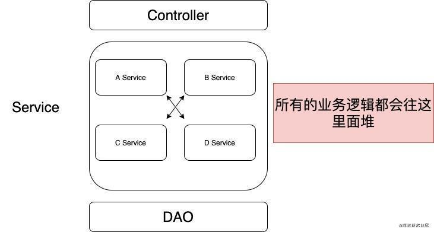
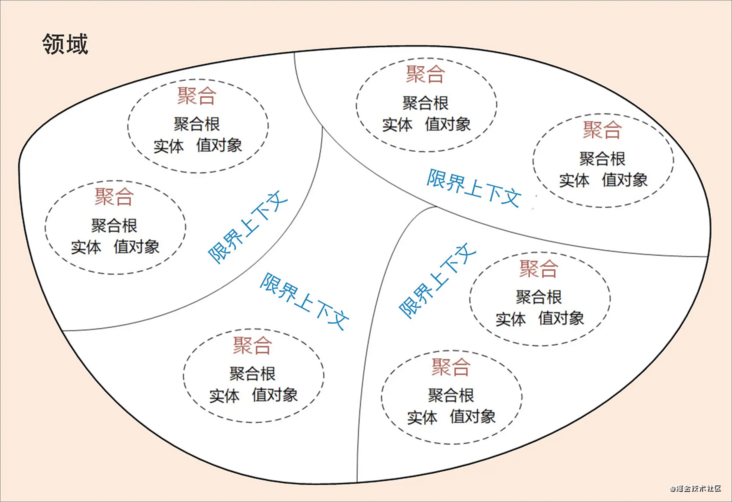
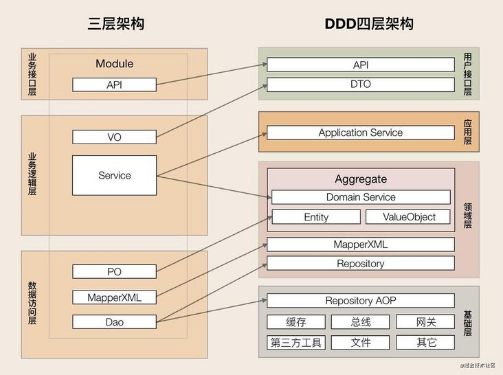
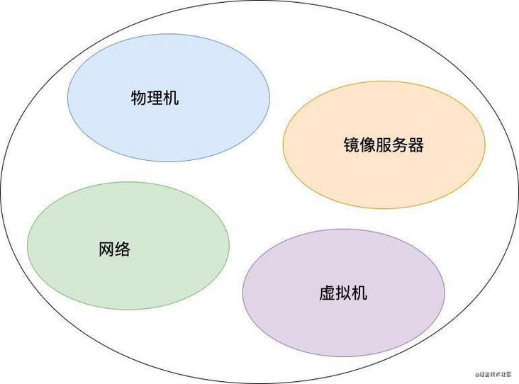
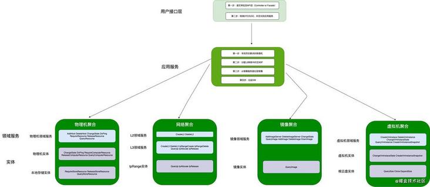
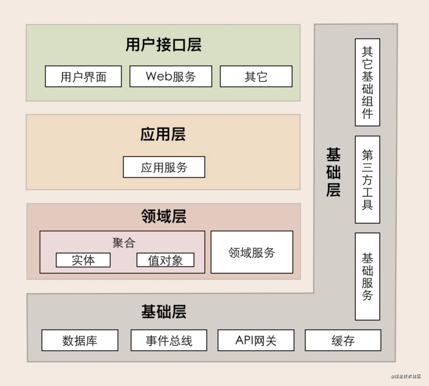
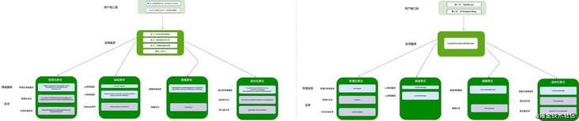

# [谈谈代码：降低复杂度，从放弃三层架构到DDD入门](https://segmentfault.com/a/1190000040443859)

## 1.前言

最近我发现团队某项目的复杂度越来越高（典型的三层架构），具体表现为：

- 代码可读性较差：各个服务之间调用复杂，流程不清晰
- 修改某服务业务代码导致大量无关服务的测试用例失败，单个功能开发者很难迅速定位相关问题
- 测试用例特别难编写，需要mock大量数据来拉起整块服务

基于这些情况，我开始寻找降低复杂度的方案，于是就有了这篇再谈DDD的文章。

### 1.1 具体问题

#### 1.1.1 宏观角度

从宏观来说，软件架构模式演进经历了三个阶段。

- 第一阶段是单机架构：采用面向过程的设计方法，系统包括客户端 UI 层和数据库两层，采用 C/S 架构模式，整个系统围绕数据库驱动设计和开发，并且总是从设计数据库和字段开始。
- 第二阶段是集中式架构：采用面向对象的设计方法，系统包括业务接入层、业务逻辑层和数据库层，采用经典的三层架构，也有部分应用采用传统的 SOA 架构。这种架构容易使系统变得臃肿，可扩展性和弹性伸缩性差。
- 第三阶段是分布式微服务架构：随着微服务架构理念的提出，集中式架构正向分布式微服务架构演进。微服务架构可以很好地实现应用之间的解耦，解决单体应用扩展性和弹性伸缩能力不足的问题。我们知道，在单机和集中式架构时代，系统分析、设计和开发往往是独立、分阶段割裂进行的。

比如，在系统建设过程中，我们经常会看到这样的情形：A 负责提出需求，B 负责需求分析，C 负责系统设计，D 负责代码实现，这样的流程很长，经手的人也很多，很容易导致信息丢失。最后，就很容易导致需求、设计与代码实现的不一致，往往到了软件上线后，我们才发现很多功能并不是自己想要的，或者做出来的功能跟自己提出的需求偏差太大。

而且在单机和集中式架构这两种模式下，软件无法快速响应需求和业务的迅速变化，最终错失发展良机。此时，分布式微服务的出现就有点恰逢其时的意思了。

上面这部分来自于极客时间，这里面指出一般DDD是使用在微服务设计与拆分上，但我认为在单体应用中做模块的拆分也是可以并推荐的，这可以让你的模块在需要时可以即刻拆分出去——变成一个独立的微服务。相关可以参考[【ZStack】4.进程内服务](https://link.segmentfault.com/?enc=pbMZ2QVfwnlVmlguQ79m9A%3D%3D.cCG8BzAMFWO72C1YaUdNgjgHVHHioN6mAeRbpAm1RoZMd4hTb0pgBe%2FiPQBhkRWp)，这是一个开源，并实施于生产中很好的一个案例。

#### 1.1.2 微观角度

这个问题很简单，service的代码必然会越堆越多，而且聚拢越来越多的业务。

## 2.DDD入门

我们先来看一张图：

从最外层开始——什么是领域？大白话来说就是一系列问题的聚合。举个例子：

- 电商平台中的电商域，你要解决的一系列问题有：
  - 用户认证
  - 移动收付
  - 订单
  - 报价
  - ...

可以看到，域是呈现出来的是一系列的业务领域问题。

在不同域中，同一个数据实体的抽象形态往往是不同的。比如，Bookstore 应用中的书本，在销售领域中关注的是价格，在仓储领域中关注的是库存数量，在商品展示领域中关注的是书籍的介绍信息。

### 2.1 上下文边界

往里面，我们应该看到的是限界上下文。其实这个翻译并不好，原文叫`bounded context`，叫做**上下文边界**更为妥当。本质上来说，它定义了边界。再具体点，即：用来封装通用语言和领域对象，提供上下文环境，保证在领域之内的一些术语、业务相关对象等（通用语言）有一个确切的含义，没有二义性。

### 2.2 聚合

接下来，我们看到了聚合。**聚合**就是由业务和逻辑紧密关联的实体和值对象组合而成的，聚合是数据修改和持久化的基本单元，每一个聚合对应一个仓储，实现数据的持久化。

聚合有一个聚合根和上下文边界，这个边界根据业务单一职责和高内聚原则，定义了聚合内部应该包含哪些实体和值对象，而聚合之间的边界是松耦合的。按照这种方式设计出来的微服务很自然就是“高内聚、低耦合”的。

那聚合根是什么呢？

聚合根的主要目的是为了避免由于复杂数据模型缺少统一的业务规则控制，而导致聚合、实体之间数据不一致性的问题。

传统数据模型中的每一个实体都是对等的，如果任由实体进行无控制地调用和数据修改，很可能会导致实体之间数据逻辑的不一致。而如果采用锁的方式则会增加软件的复杂度，也会降低系统的性能。

如果把聚合比作组织，那聚合根就是这个组织的负责人。聚合根也称为根实体，它不仅是实体，还是聚合的管理者。

首先它作为实体本身，拥有实体的属性和业务行为，实现自身的业务逻辑。

其次它作为聚合的管理者，在聚合内部负责协调实体和值对象按照固定的业务规则协同完成共同的业务逻辑。

最后在聚合之间，它还是聚合对外的接口人，以聚合根 ID 关联的方式接受外部任务和请求，在上下文内实现聚合之间的业务协同。也就是说，聚合之间通过聚合根 ID 关联引用，如果需要访问其它聚合的实体，就要先访问聚合根，再导航到聚合内部实体，外部对象不能直接访问聚合内实体。

### 2.3 实体与值对象

在 DDD 中有这样一类对象，它们拥有唯一标识符，且标识符在历经各种状态变更后仍能保持一致。对这些对象而言，重要的不是其属性，而是其延续性和标识，对象的延续性和标识会跨越甚至超出软件的生命周期。我们把这样的对象称为**实体**。其实很像数据库里自带不变id的一行行业务数据。

值对象相对不是那么重要，因为它是用来描述实体的一组属性集。很多系统中的实现会以json来实现，比如[【ZStack】7.标签系统](https://link.segmentfault.com/?enc=Ur8B4vpftMiHMyeSAVIlCw%3D%3D.b9LV7kTbykRW7LhUuoSCS4%2BmEQaB1uL%2B%2BqaMakIaDtB6AIlLIpzV52%2B44g00BYhQ)。

为了方便理解，这边做个小结。实体和值对象的目的都是抽象聚合若干属性以简化设计和沟通，有了这一层抽象，我们在使用人员实体时，不会产生歧义，在引用地址值对象时，不用列举其全部属性，在同一个限界上下文中，大幅降低误解、缩小偏差，两者的区别如下：

1. 两者都经过属性聚类形成，实体有唯一性，值对象没有。在本文案例的限界上下文中，人员有唯一性，一旦某个人员被系统纳入管理，它就被赋予了在事件、流程和操作中被唯一识别的能力，而值对象没有也不必具备唯一性。
2. 实体着重唯一性和延续性，不在意属性的变化，属性全变了，它还是原来那个它；值对象着重描述性，对属性的变化很敏感，属性变了，它就不是那个它了（意味着不可变性，它可能是从外部查询来的）。
3. 战略上的思考框架稳定不变，战术上的模型设计却灵活多变，实体和值对象也有可能随着系统业务关注点的不同而更换位置。比如，如果换一个特殊的限界上下文，这个上下文更关注地址，而不那么关注与这个地址产生联系的人员，那么就应该把地址设计成实体，而把人员设计成值对象。

## 3. DDD上手

### 3.1 从三层模型到DDD

这里先简单介绍一下三层模型到DDD对应的一个变化。

可以的看得出来，主要是对service进行了拆分。一般可以拆成三层：

- 应用服务层：多个领域服务或外部应用服务进行封装、编排和组合，对外提供粗粒度的服务。应用服务主要实现服务组合和编排，是一段独立的业务逻辑。
- 领域服务层：由多个实体组合而成，一个方法可能会跨实体进行调用。在代码过于复杂的时候，可以将每个领域服务拆分为一个领域服务类，而不是将所有领域服务代码放到一个领域服务类中。
- 实体：是一个充血模型。同一个实体相关的逻辑都在实体类代码中实现。

### 3.2 建模简介

我们可以用三步来划定领域模型和微服务的边界。

- 第一步：在事件风暴中梳理业务过程中的用户操作、事件以及外部依赖关系等，根据这些要素梳理出领域实体等领域对象。
- 第二步：根据领域实体之间的业务关联性，将业务紧密相关的实体进行组合形成聚合，同时确定聚合中的聚合根、值对象和实体。在第二章的图里，聚合之间的边界是第一层边界，它们在同一个微服务实例中运行，这个边界是逻辑边界，所以用虚线表示。
- 第三步：根据业务及语义边界等因素，将一个或者多个聚合划定在一个限界上下文内，形成领域模型。在上面的图里，限界上下文之间的边界是第二层边界，这一层边界可能就是未来微服务的边界，不同限界上下文内的领域逻辑被隔离在不同的微服务实例中运行，物理上相互隔离，所以是物理边界，边界之间用实线来表示。

### 3.3 实践：设计一个MiniStack

为了便于大家理解，我在这里会设计一个很简单的Iaas平台，并在里面代入最基本的DDD概念。

#### 3.3.1 产品愿景

- 为了：企业的内部的开发者、运维人员
- 他们的：计算、存储、网络资源管理
- 这个：MiniStack
- 是一个：私有云平台
- 它可以：管理计算、存储、网络资源管理，帮用户简单快速的创建虚拟机
- 而不像：OpenStack
- 我们的产品：简单、健壮、智能

串起来就是：为了满足企业的内部的开发者和运维人员，他们的硬件资源管理，我们建设里这个MiniStack，它是一个私有云平台，它可以管理计算、存储、网络资源管理，帮用户简单快速的创建虚拟机，而不像OpenStack，我们的产品简单、健壮、弹性。

#### 3.3.2 场景分析

因篇幅原因，我们来聊个最典型的场景——创建虚拟机，以便理出相关的领域模型。

在这里我们需要注意，我们要尽可能的梳理整个系统发生的操作、命令、领域时间以及依赖变化等。

##### 3.3.2.1 创建虚拟机

1. 用户登陆系统：从数据库中对信息进行校验，完成登陆认证
2. 创建虚拟机：填写虚拟机名、集群、计算规格、L3网络以及镜像。如果需要的话（简单的体现），可以指定所在的物理机、以及网段。
   - VM服务需要提供创建虚拟机接口
3. 提交至MiniStack引擎，引擎开始做相关调度：
   1. 寻找符合计算、存储资源的低负载物理机，并更新vm所属的物理机
      - 物理机服务需要提供查询接口
   2. 分配L3网络中的空闲IP，并更新vm相关的网络信息
      - 网络服务需要提供IP分配接口
   3. 告诉物理机agent：从镜像服务器拉取镜像到第1步寻找出的物理机
      - 物理机服务需要提供拉取镜像接口
   4. 告诉物理机agent启动参数，拉起vm
      - VM服务需要提供启动接口
4. 界面上返回创建成功，用户可以看到vm

但创建完虚拟机以后并不是就这么完事了，万一哪天这台物理机carsh了呢？哪天CPU因为奇怪的进程而打满了呢？因此为了我们的目标——智能，创建vm后，MiniStack每5分钟收集一系列的监控信息:

1. 向物理机agent发送心跳包，确保物理机状态正常
2. 向虚拟机agent发送心跳包，并会返回：计算、存储、网络的相关状态

#### 3.3.3 宏观设计：领域建模

在这一步，我们需要对业务进行分析，建立领域模型。一般步骤为：

1. 找出领域实体和值对象等领域对象
2. 找出聚合根，根据实体、值对象与聚合根的依赖关系，建立聚合
3. 第三步根据业务及语义边界等因素，定义限界上下文

##### 3.3.3.1 定义实体

我们大致可以找出几个实体：

- 虚拟机
  - 启动
  - 停止
- 物理机的存储资源
  - 查询
  - 分配
  - 释放
- 物理机的计算资源
  - 查询
  - 分配
  - 释放
- L3网络
  - 分配IP
- 镜像服务器
  - 查询镜像
  - 添加镜像
  - 发布镜像

##### 3.3.3.2 定义聚合与限界上下文

在找聚合前，我们先要找出聚合根。可以分为物理机、网络、镜像服务器、虚拟机。而他们彼此都是独立的上下文，在需要的情况下，也可以拆成一个个微服务，如果是单体应用，则建议用模块手段进行逻辑隔离。

#### 3.3.4 微观：领域对象与代码结构分析

当我们完成宏观上的建模后，便可以开始做微观的事：梳理微服务内的领域对象，梳理领域对象之间的关系，确定它们在代码模型和分层架构中的位置，建立领域模型与微服务模型的映射关系，以及服务之间的依赖关系。

大致上，分位两步：

1. 分析领域对象
2. 设计代码结构

##### 3.3.4.1 分析领域对象

在这一步，我们需要确认：

- 服务的分层
- 应用服务由哪些服务组成
- 领域服务包含哪些实体和实体方法
- 哪个实体是聚合根
- 实体有哪些属性和方法
- 哪些对象为值对象

由于我们的用例比较简单，整理如下：

- 应用服务：
  - VM创建服务：负责创建VM，会调度大量的底层领域服务
- 领域服务：VM服务、物理机服务、网络服务、镜像服务
  - VM服务：管理VM的生命周期，如创建、删除、启动、停止等
  - 物理机服务：物理机相关服务，如添加、删除、状态变更、心跳感知、资源RUD等
  - 网络服务：网络相关服务，如创建删除L2、L3网络，IP管理等
  - 镜像服务：镜像服务器相关服务，如添加、删除、状态变更、增加镜像等
- 实体：VM实体、物理机实体、本地存储实体（物理机存储）
  - VM实体：启动、停止等
  - 物理机实体：状态变更、心跳感知等
  - L3实体：IP段添加、删除、IP分配、释放等
  - 本地存储实体：存储的占用与释放
  - 镜像：查询镜像大小

接下来看一下聚合中的对象，我们把聚合以及聚合根识别出来：

- 物理机聚合的中的聚合根是物理机
- 网络聚合中的聚合根是L2网络
- 镜像聚合中的聚合根是镜像服务器
- 虚拟机聚合中的聚合根是虚拟机实体

而上面提到的实体属性与方法我们已经在图中呈现出来了。

关于值对象，可以参考[【ZStack】7.标签系统](https://link.segmentfault.com/?enc=SEqy3cRh0gzzFrmrAxcYSA%3D%3D.%2BRTRYwh%2BT6h8%2BHOWVz4qPXyLdqXTVAMljkMa5ipW0dM4Lub%2BbZM7DB%2F0Q%2BfkWNCY)。该设计用于真实生产中。

##### 3.3.4.2 设计代码结构

当我们完成领域对象的分析后，我们便开始设计各领域对象在代码模型中的呈现方式了——即建立领域对象与代码对象的映射关系。根据这种映射关系，服务人员可以快速定位到业务逻辑所在的代码位置。

宏观上，我们可以参考以下分层模型：

微观实施上，我们可以参考[COLA](https://link.segmentfault.com/?enc=c%2BLb15kf6%2BqDsKBHy%2FEh1Q%3D%3D.m4f4fs3HXDXfj2uWlf%2BJgySq693nJucJH%2B7vrzSstyM%3D)。

## 4.小结

本文和大家一起捋了一遍DDD，并在文里“凭空的”设计了一个项目。其实这个项目并非凭空，我参考了以前参与的开源项目ZStack并对它做出了简化——该项目目前跑在大量的企业用户的私有云中，迭代已有6年多。因此无论从设计还是落地来说，都有一定的参考经验。

为了大家方便将文中的例子结合ZStack代码理解，我这边做了一个映射。

当然，本篇的内容仅仅只能作为入门。并未深入相关概念，如：`子域`、`核心域`、`通用域`、`支撑域`、`领域事件`等；对于实战篇也仅仅设计了一个较为简单例子，并没有深究设计原则与架构演进路线。之后有机会的话，我会继续深入相关方向。

### 4.1 参考资料

- 关于ZStack的资料
  - [【ZStack】4.进程内服务](https://link.segmentfault.com/?enc=ZM3knvxXMm6wfmkNxNzSDw%3D%3D.ZOFjKTm5hKzJJEsk2eNALUCRtxv8o3iEfEshJBKfwM2vRbRXIUkYIg5bD70vjecV)
  - [【ZStack】7.标签系统](https://link.segmentfault.com/?enc=SvFFsIa3DxULU%2BOdnPtIeQ%3D%3D.2w99qYyLgv60CEWlo%2BpWQricE6GtTniesRoi2F4hJ9SQLeP%2BRn%2FahcB%2FK3YqQ%2FKf)
  - [【ZStack】9.查询API](https://link.segmentfault.com/?enc=SQulU9xo%2FmE4qhifD6thug%3D%3D.NqsRMwjVcUCZu3mdB1S5%2FsoFDeOGz3jJuGAqSfpMUD7DhbJ9%2FeQtdIfhNEmhhZTl)
  - [ZStack源码剖析：如何在百万行代码中快速迭代](https://link.segmentfault.com/?enc=hvUiJCn0wimmXczi18vByA%3D%3D.Bh9Ue%2B7kOwfxN6qMvzlouz6KgF5exTdew3GaL8AGXj2n3%2FAsoMPmcGoYnfI9ijiX)
  - [ZStack源码剖析之设计模式鉴赏——三驾马车](https://link.segmentfault.com/?enc=%2Bus21exjzCqyH%2FMgKXkDpw%3D%3D.W445pFZuBNCBBbGiUDvln1wYvJsSq0iZIbjQfIaAh0mk4o6waTw%2FUsmWVOqbBywG)
  - [ZStack Github Repo](https://link.segmentfault.com/?enc=1N3dG8M4LAQ8qv8lhonfag%3D%3D.0eWS5SwOwTAIWd2BT4xJuSpmc2ybYfeX5UKzZKkOeM3XhHSXZ8EvCQLAdQyhonmY)
- 虽然ZStack是个值得参考的项目，但其DDD的设计并不是特别明显。因此在项目分层上也可以参考[COLA](https://link.segmentfault.com/?enc=Zis0WBxXkQyNgYwng4WUtg%3D%3D.eNIUU8Y1ygfxjVYyMREZnd%2FPrT5ZmICw7iGgehh%2FVqs%3D)
- 《领域驱动设计》
- 极客时间——DDD实战课