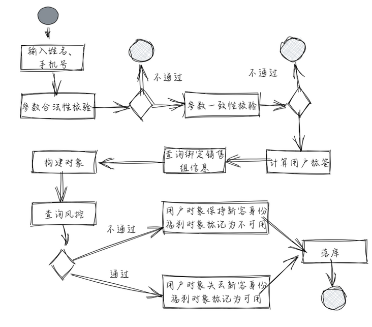

# 领域驱动设计入门与实践 [下]

上期对 DDD 进行了简单的介绍，Phone Number 案例也使我们对 DDD 有了进一步的了解。

通过该案例，我们了解到 PhoneNumber 包含了初始化、校验、属性处理等多种逻辑，而传统的 POJO 类只包含其属性的getter setter方法。这是 DDD 和传统面向数据开发的重要差异点。

「PhoneNumber-充血模型」与「POJO 类-贫血模型」不难理解，笔者在「[领域驱动设计入门与实践-上](https://segmentfault.com/a/1190000041627211)」中已对其做过介绍。难的是在实际项目中，若使用充血模型，如何把握好其强弱程度需要很丰富的经验。

## DP（Domain Primtive）

我们将PhoneNumber这种类型称为 DP- Domain Primitive。类比 Integer、String 在 Java 编程语言中一样，DP 是 DDD 里一切模型、方法、架构的基础。

#### 定义 DP：

在 DDD 里，DP 可以说是一切模型、方法、架构的基础，它是在特定领域，拥有精准定义、可自我验证、拥有行为的对象，可认为是领域的最小组成部分。

#### 使用 DP 的三条原则：

- 将隐性概念显性化/Make Implicit Concepts Expecit
  在Phone Number这个案例中，若使用 String 类型来定义电话号码，则「归属地编号」、「运营商编号」这些属于电话号码的隐性属性就难以体现出来，我们通过自定义类型PhoneNumber，通过赋予它行为来显性化了这两个概念，让代码的业务语义更加明确。

这里我们通过一个例子来说明：

假设现在要实现一个功能: 使 A 用户可以支付 x 元给用户 B，可能的实现如下：

```java
public void pay(BigDecimal money, Long recipientId) {     
    bankService.transfer(money, "CNY", recipientId); 
}
```

如果这个是境内转账，并且境内的货币永远不变，该方法似乎没啥问题。一旦货币变更或做跨境转账，该方法留有明显的 bug，因为 `Money` 对应的不一定是 `CNY`。

在这个 case 里，当我们说“支付 x 元”时，除了 x 本身的数字外，还有一个隐含的概念「元」。

在原始的入参中，只用BigDecimal的原因是我们默认CNY货币是不变的，是一个隐含的上下文条件。但当我们写代码时，要**把所有隐性的条件显性化，然后整体组成当前的上下文**：做「支付」时，我们将「支付金额」&「货币种类」作为一个入参输入进来，两者整合成一个完整而独立的概念：Money。

原有的代码变为：

```java
public class Money {     
    private final BigDecimal amount;     
    private final Currency currency;       
    public Money(BigDecimal amount, Currency currency) {         
        this.amount = amount;         
        this.currency = currency;     
        } 
    }  

    public void pay(Money money, Long recipientId) {     
        bankService.transfer(money, recipientId); 
    }
}
```

通过将默认货币这个隐性的上下文概念显性化，并且和金额合并为 Money，我们避免了很多当前看不出来未来可能会暴雷的 bug。

- 封装多对象行为/Encapsulate Multi-Object Behavior

将前面的案例升级一下：用户要做跨境转账，从 CNY 到 USD 且汇率随时在波动。

代码块：

```java
public void pay(Money money, Currency targetCurrency, Long recipientId) {
    if (money.getCurrency().equals(targetCurrency)) {
        bankService.transfer(money, recipientId);
    } else {
        BigDecimal rate = exchangeService.getRate(money.getCurrency(), targetCurrency);
        BigDecimal targetAmount = money.getAmount().multiply(new BigDecimal(rate));
        Money targetMoney = new Money(targetAmount, targetCurrency);
        bankService.transfer(targetMoney, recipientId);
    }
}
```

这个 case 里

1、targetCurrency 不等于 money Curreny

2、调用一个服务去取汇率，然后做计算

3、用计算后的结果做转账

最大的问题在于**金额的计算被包含在支付的服务中，涉及多个对象**：2 个 Currency，2 个 Money，1 个 BigDecimal。这种涉及到多个对象的业务逻辑，我们要用 DP 包装。

应用 DP 的**封装多对象行为**，将转换汇率的功能封装到一个叫做 ExchangeRate 的 DP 里：

ExchangeRate 被定义为汇率对象，通过**对金额计算逻辑 &各种校验逻辑封装**，使原始代码变得简单：

```java
public class ExchangeRate {
    private final BigDecimal rate;
    private final Currency from;
    private final Currency to;
    public ExchangeRate(BigDecimal rate, Currency from, Currency to) {
        this.rate = rate;
        this.from = from;
        this.to = to;
    }
    public Money exchange(Money fromMoney) {
        notNull(fromMoney);
        isTrue(this.from.equals(fromMoney.getCurrency()));
        BigDecimal targetAmount = fromMoney.getAmount().multiply(rate);
        return new Money(targetAmount, to);
    }
}
public void pay(Money money, Currency targetCurrency, Long recipientId) {
    ExchangeRate rate = exchangeService.getRate(money.getCurrency(), targetCurrency);
    Money targetMoney = rate.exchange(money);
    bankService.transfer(targetMoney, recipientId);
```

## 案例讲解



```java
public class RegistrationServiceImpl implements RegistrationService {
    private final SalesRepMapper salesRepDAO;
    private final UserMapper userDAO;
    private final RewardMapper rewardDAO;
    private final TelecomRealnameService telecomService;
    private final RiskControlService riskControlService;

    public User register(String name, PhoneNumber phone) throws ValidationException {
        TelecomInfoDTO rnInfoDTO = telecomService.getRealnameInfo(phone.getNumber());
        if (!Objects.equals(name, rnInfoDTO.getName())) {
            throw new InvalidRelnameException();
        }
        // 计算用户标签
        String label = getLabel(rnInfoDTO);
        // 计算销售组
        String salesRepId = getSalesRepId(phone);
        // 构造User对象和Reward对象
        String idCard = rnInfoDTO.getIdCard();
        UserDO userDO = new UserDO(idCard, name, phone.getNumber(), label, salesRepId);
        RewardDO rewardDO = new RewardDO(idCard, label);

        // 风控逻辑
        if (!riskControlService.check(idCard, label)) {
            userDO.setNew(true);
            rewardDO.setAvailable(false);
        } else {
            userDO.setNew(false);
            rewardDO.setAvailable(true);
        }
        // 持久化数据
        rewardDAO.insert(rewardDO);
        return userDAO.insert(userDO);
    }

    private String getLabel(TelecomInfoDTO telecomInfoDTO) {
        // TODO
    }

    private String getSalesRepId(PhoneNumber phone) {
        SalesRepDO repDO = salesRepDAO.select(phone.getAreaCode(), phone.getOperatorCode());
        if (repDO != null) {
            return repDO.getRepId();
        }
        return null;
    }
}
```

常规逻辑和实现代码。我们先来给它挑挑刺，再利用领域驱动设计的思想来重构。发现

**问题 1>> 对外部依赖的耦合非常严重**

一切不属于当前域内的设施和服务，都可认为是外部依赖。比如：数据库，数据库 Schema，RPC 服务，ORM 框架，中间件…..并且都是可替换的。我们要做的是**把由外部依赖变化导致的自己系统内发生的变动控制在最小范围。**

> “由外部依赖变化导致的内部系统的改造程度，我们可以理解为一个系统的可维护性。”

在检查这段代码的可维护性前，我们先来看看它有哪些外部依赖：

**1-1、数据库 Schema**

这里的业务代码强依赖数据库 schema，也就是 DO 类。一旦数据表的字段产生变动，DO 类就会随之变动。

但 DO 在这段代码里到处都是，并且将 UserDO 这个对象传递到了方法外部。一旦业务逻辑复杂起来、DO 发生变化，这段代码就会面目全非，甚至很可能会破坏掉原有正常的功能。

**1-2、ORM 框架**

此代码使用了大家熟悉的 MyBatis 框架：使用 Mapper 这种 DAO 对象来构建和执行 SQL。

如果框架本身没有向下兼容、API 产生了变化，系统要升级框架；或出于对安全问题的考虑，系统要替换整个 ORM 框架，业务代码要进行大量的变动。这是不合理且存在风险的。

**1-3、RPC 服务**

使用中国电信提供的手机号实名信息查询服务，强依赖在业务逻辑中。一旦中国电信提供的接口入参和返回都产生变动，或者变更服务商，那么业务逻辑代码也要进行相应的修改。说起来简单做起来难，建议抱有此想法的童鞋趁早放弃，不要给自己找锅背。

分析了以上三种依赖，大家已经了解了代码耦合度高的原因。**如何改造？**

思路：将其改造成面向抽象接口的编程。这样，DDD 将会作为一种指导思想辅助我们设计。

**>> 针对数据访问抽象**

有两个关键点：

1、DO 是具体实现，不应直接暴露给业务逻辑

2、DAO 作为访问数据库的具体实现

引入领域驱动设计中的 Entity 和 Repository。

上层的业务逻辑不需要关心下层的具体实现。

这里定义了一个 User 类—Entity，一种领域实体类。User 类中的属性用于描述这个系统内客户应该含有的信息，应尽量多的使用 DP 来将更多的自检和隐性属性内聚起来。

参照这句话**「上层的业务逻辑不需要关心下层的具体实现」** ，在定义 User 类的时候，我们不关心下层数据库的具体实现、User 对象的存储在哪里，我们只需要关注如何去描述这个领域实体。

> “有人可能会对 Entity 和 DP 的差别产生疑惑，它们最本质的差异就是主语义上能否拥有数据状态。”

Repository 就是数据访问的抽象层。在抽象层中，我们只定义动作。

比如这里的 UserRepository，只定义了 find 和 save 这两个动作，这样在实现类中，我们就可以依赖数据库访问相关的具体实现，然后，直接依赖 MyBatis 框架，比较 Redis Client 等各种数据库操作。

通过对数据访问层的改造，我们再来看业务代码，改造前：

```java
// User Entity
public class User extends Entity {
    private UserId userId;
    private PhoneNumber phone;
    private Label label;
    private SalesRepId salesRepId;
    private SalesRepRepository salesRepRepository;

    public User(RealnameInfo info, String name, PhoneNumber phone) {
        // 参数一致性校验，若校验失败，则check内抛出异常（DP的优点）
        info.check(name);
        initId(info);
        labelledAs(info);
        this.salesRepId = salesRepRepository.ofPhone(phone).getRepId();
    }

    // 对this.userId赋值
    private void initId(RealnameInfo info) {

}

    // 对this.label赋值
    private void labelledAs(RealnameInfo info) {
        // 本地处理逻辑
    }
}
```

改造后：

```java
public interface UserRepository {
    User ofId(UserId id);
    User ofPhone(PhoneNumber phone);
    User save(User user);
}
public class UserRepositoryImpl implements UserRepository {
    private final UserMapper userMapper;
    private final UserConverter userConverter;@Override public User ofId(UserId id) {
        UserDO userDO = userMapper.selectById(id.value());
        return userConverter.fromDO(userDO);
    }
    @Override 
    public User ofPhone(PhoneNumber phone) {
        UserDO userDO = userMapper.selectByPhone(phone.getNumber());
        return userConverter.fromDO(userDO);
    }
    @Override 
    public User save(User user) {
        UserDO userDO = userConverter.toDO(user);
        if (userDO.getId() == null) {
            userMapper.insert(userDO);
        } else {
            userMapper.update(userDO);
        }
        return userConverter.fromDO(userDO);
    }
}
```

**>> RPC 调用抽象**

这里主要有两块改动：

1、使用 RealnameService 接口类替代 TelecomRealnameService 具体实现类— **依赖倒置**

2、**DP 具体逻辑内聚**：使用 RealnameInfo 这个 DP 来代替 TelecomInfoDTO 这个具体实现。这样无论外部服务是参数变化还是替换实现，我们都将变动范围控制在了具体实现类和配置文件内部，保证了核心业务逻辑的稳定。

这里还要引入一个概念：

> “防腐层（Anticruption Layer）：防止外部系统的腐烂影响到我们自己的系统。这里的 RealnameService 就是我们的防腐层。”

代码如下：

```java
public class RegistrationServiceImpl implements RegistrationService {
    private final SalesRepMapper salesRepDAO;
    private final UserMapper userDAO;
    private final RewardMapper rewardDAO;
    private final RealnameService realnameService;
    private final RiskControlService riskControlService;

    public User register(String name, PhoneNumber phone) throws ValidationException {
        RealnameInfo realnameInfo = realnameService.get(phone);
        realnameInfo.check(name);

        // 计算用户标签
        String label = getLabel(rnInfoDTO);
        // 计算销售组
        String salesRepId = getSalesRepId(phone);
        // 构造User对象和Reward对象
        String idCard = realnameInfo.getIdCard();
        UserDO userDO = new UserDO(idCard, name, phone.getNumber(), label, salesRepId);
        RewardDO rewardDO = new RewardDO(idCard, label);

        // 风控逻辑
        if (!riskControlService.check(idCard, label)) {
            userDO.setNew(true);
            rewardDO.setAvailable(false);
        } else {
            userDO.setNew(false);
            rewardDO.setAvailable(true);
        }
        // 持久化数据
        rewardDAO.insert(rewardDO);
        return userDAO.insert(userDO);
    }
}
```

**问题 2 >> 逻辑混乱**

```java
public class RegistrationServiceImpl implements RegistrationService {
    private final UserRepository userRepository;
    private final RewardRepository rewardRepository;
    private final RealnameService realnameService;
    private final RiskControlService riskControlService;

    public User register(String name, PhoneNumber phone) {
        // 查询实名信息
        RealnameInfo realnameInfo = realnameService.get(phone);

        // 构建对象
        User user = new User(realnameInfo, phone);
        Reward reward = new Reward(user);

        // 检查风控
        if (!riskControlService.check(user)) {
            user.fresh();
            reward.inavailable();
        }
        // 持久化
        rewardRepository.save(reward);
        return userRepository.save(user);
    }
}
```

Register 方法的语义，只是注册。在最初的代码中， Register 方法中已经耦合了许多不属于「注册」这个业务域需要关心的逻辑，这为后边的业务修改无形中增添了不少工作量。

> “由内部业务逻辑变化所导致的内部系统的改造程度，我们可以狭义的理解为系统的可扩展性”

回到这个例子，注册的外部逻辑已经进行了一定程度的解耦，但它依然不纯粹：「奖品对象」和「风控检查」为什么会耦合在注册逻辑中呢？如果，之后的发奖逻辑产生变动，注册方法还要修改吗？

我们继续思考：

- 发奖是为了给予新用户一些福利，本质是判断当前用户是否为新用户
- 在注册这个业务域中，我们将它的行为抽象为「获取用户信息」，「检查并更新用户」，「存储用户信息」，这三个步骤不无不合理之处
- 在「检查并更新用户」这个逻辑中，存在发奖这种衍生行为与其他可能的行为

理清逻辑后，我们来看下最终代码：

```java
public interface CheckUserService {
    void check(User user);
}

public class CheckUserServiceImpl implements CheckUserService {
    private final RiskControlService riskControlService;
    private final RewardRepository rewardRepository;

    @Override public void check(User user) {
        rewardCheck(user);
        // ...
        // 可能存在的其他逻辑
    }

    private void rewardCheck(User user) {
        Reward reward = new Reward(user);
        // 检查风控
        if (!riskControlService.check(user)) {
            user.fresh();
            reward.inavailable();
        }
        rewardRepository.save(reward);
    }
}
```

这里需要注意一点：CheckUserService 中进行检查时，可能会改变 User 对象和 Reward 对象的状态，涉及到了多个 Entity 状态改变的服务，被称为 Domain Service。Domain Service 主要用于封装多 Entity 或跨业务域的逻辑。

根据最终的代码块显示，核心逻辑已清晰，可维护性和可扩展性也大大增强 √

## 来说下单元测试

改造前的代码，多个业务逻辑耦合在一起；

改造后的代码，通过对业务逻辑的解耦，测试用例变得更容易维护。

随时间推移，迭代增多，单元测试会花费更少的精力，获得更高的单元测试覆盖率。这就是逻辑内聚 &解耦给单元测试所带来的好处。

代码改造前：


代码改造后：


## 归纳概念

**>> DP**

：抽象并封装自检和一些隐性属性的计算逻辑，这些属性是无状态的

**>> Entity**

：抽象并封装单对象有状态的逻辑

**>> Domain Service**

：抽象并封装多对象的有状态逻辑

**>> Repository**

：抽象并封装外部数据访问逻辑

**>> 领域驱动设计的指导思想**

- 首先对业务问题进行总览
- 然后对领域对象-Entity 进行划分，明确每个领域对象包含的信息和职
- 责边界，进行跨对象，多对象的逻辑组织-Domain Service
- 接着在上层应用中根据业务描述去编排-Entity & Domain Service
- 最后做一些基础设施工作：对下层的数据访问，RPC 调用去做一些具体实现

值得说明的一点是：在实践工作过程中，DDD 只是对我们进行一种指导，我们不必按部就班，全盘照抄上述这种设计规范，但要遵循**「高内聚低耦合」** 的思想，**对边界的划分与控制是领域驱动设计强调的核心思想。**

## 架构

DDD 的一大好处是它不需要使用某些特定的架构。

由于核心域位于限界上下文中，我们可以在整个系统中使用多种风格的架构。有些架构包围着领域模型，能够全局性地影响系统;有些架构满足了某些特定的需求。我们的目标是 **选择适合自己的架构和架构模式。**

这里我们简单的介绍两种在 DDD 落地过程中比较实用的架构风格：

**>> Clean Architecture**


目标：框架无关、可测试、UI 无关、数据库无关、外部代理无关

> > COLA Architecture


COLA 代表了简洁的业务思想：

1、COLA 是一种架构思想，是整合了洋葱圈架构、适配器架构、DDD、整洁架构、TMF 等架构思想的一种应用架构；2、 COLA 也是框架组件。

应用架构的本质，就是要从繁杂的业务系统中提炼出共性，找到解决业务问题的最佳模式，为开发人员提供统一的认知，治理混乱。“从混乱到有序”=定义良好的应用结构，提供最佳实践。

**领域驱动设计入门与实践「上 &下」至此完结。全文作者：nerd4me ，一枚优秀的程序员小编~**