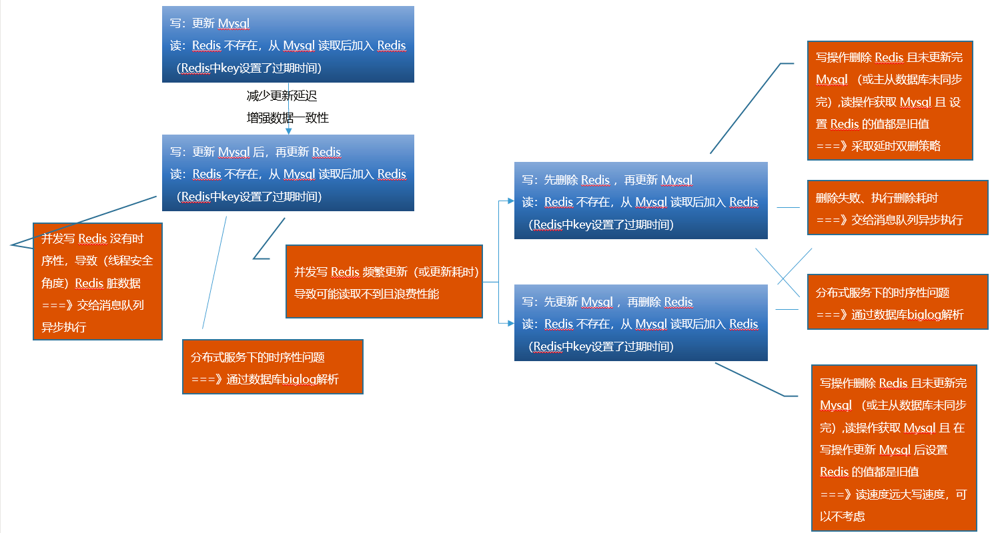

# [缓存使用问题 —— 缓存一致性问题解决方案](https://my.oschina.net/xiaohai945/blog/5004803)

## 1、理解缓存使用场景及一致性问题

数据库存储通常支持完整的ACID特性，因为可靠性、持久性等因素，性能普遍不高，高并发的查询会给数据库带来压力，造成数据库系统的不稳定。同时也容易产生延迟。 根据局部性原理，80%请求会落到20%的热点数据上，在**读多写少**场景，在请求数据库之前增加一层缓存非常有助提升系统吞吐量和健壮性。

存储的数据随着时间可能会发生变化，而缓存中的数据就会不一致。具体能容忍数据不一致的时间，需要具体业务具体分析，但是通常的业务，都需要做到最终一致性。


## 2、寻找解决方案（选择Mysql数据库，Redis作为数据缓存）

> 方案一：设置Redis中key的过期时间，写->Mysql更新，读->Redis没有key时，从Mysql取值新增key；
>
> 不足：完全依赖过期时间，时间太短容易缓存频繁失效；时间太长更新延迟导致数据不一致；

以下方案均在方案一的基础上扩展，key过期时间作为兜底。

> 方案二：写->Mysql更新，且更新Redis，读->Redis没有key时，从Mysql取值新增key；
>
> 优点：较方案一，更新延迟更小，不一致问题减少；
>
> 不足：（省去硬件成本、开发成本的考虑）
>
> - 当Reids更新失败，就退化到了方案一的问题；
> - 同时有写操作请求A和写操作请求B进行Mysql更新操作，A更新Mysql——B更新Mysql——B更新缓存——A更新缓存，出现请求A更新缓存在请求B之后，导致脏数据；（集中写操作，导致缓存频繁更新，数据读取不到。更新Redis之前计算逻辑过于复杂耗时，影响缓存使用性能）
>
> 1. 引入消息队列（保证可靠性），将Redis更新操作交给诸如kafaka的消息队列，再搭建一个服务消费，去异步更新Redis。
> 2. 在多台服务器并发情况下还是不能保证时序性，此时可以通过订阅binlog来更新Redis，搭建的消费服务作为Mysql的一个Slave，订阅binlog解析出更新内容，再更新到Redis

> 方案三：写->先删除Redis，再更新Mysql，读->Redis没有key时，从Mysql取值新增key；
>
> 优点：较方案一，更新延迟更小，不一致问题减少；较方案二，提高Redis服务使用性能；
>
> 不足：（省去硬件成本、开发成本的考虑）
>
> 同时有请求写操作A和读操作B，A删除Redis中key——B发现key不存在——B获取Msql旧值——B将旧值key写入Redis——A更新Mysql，导致数据不一致问题，好在有过期时间，否则Redis永远都是脏数据。此处可以通过双删策略来处理，看一下伪代码：
>
> ```java
> public void write(String key,Object data){
> 
> 　　redis.delKey(key);
> 
> 　　db.updateData(data);
> 
> 　　Thread.sleep(1000);
> 
> 　　redis.delKey(key);
> 
> }
> ```
>
> 将1秒内所造成的缓存脏数据删除步骤中，1秒是怎么确定的？就需要评估项目的读操作逻辑耗时，然后就在此处设置为读耗时加几百毫秒。这么做的目的是确保读请求结束，写请求可以删除读请求造成的缓存脏数据。
>
> 延伸问题：如果Mysql的读操作是数据分离架构怎么办？同时有请求写操作A和读操作B，A删除Redis中key——A更新Mysql——B发现Redis中key不存在——B获取未同步从库的Msql旧值——B将旧值key写入Redis，还是使用双删延时策略，只是将睡眠时间改为主从同步时间加几百毫秒。采用同步淘汰策略，发现吞吐量降低怎么办？可以将第二次删除作为异步去处理，写操作就不需要睡眠了。但要是第二次删除失败怎么办？失败又会导致数据不一致，那么又要交给消息队列去重试

> 方案四：写->更新Mysql，再删除Redis，读->Redis没有key时，从Mysql取值新增key；
>
> 优点：较方案一，更新延迟更小，不一致问题减少；较方案二，提高Redis服务使用性能；较方案三，不需要加入延时双删策略；
>
> 不足：（省去硬件成本、开发成本的考虑）
>
> - 同时有读操作A和写操作B两个请求，缓存刚好失效——A读取Msql旧值——B将新值写入Mysql——B删除Redis中key——A将旧值写入Redis中，又又又发生了脏数据，但发生上述情况就要有天生条件：读数据库操作耗时大于写数据库耗时。但常规情况，数据库读操作是远远快于写操作的，因此这种情况很难出现。即使出现，也可以使用上述的异步延时删除策略，保证读请求完成后再进行删除操作。
> - 删除缓存失败了，B将新值写入Mysql——B删除Redis中key失效——A直接从Reids中取值了，有两种解决方案：
>
> 1. 让消息队列不断去重试
> 2. 通过订阅binlog解析出数据库执行更新内容，再放到消息队列，最后更新到Redis

关于数据一致性解决方案的思路流程，画了如下草图：



 

 