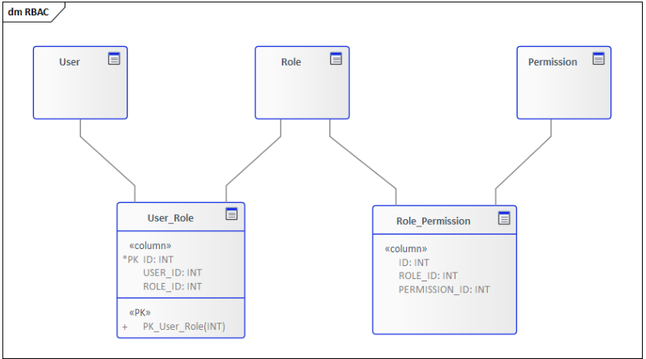
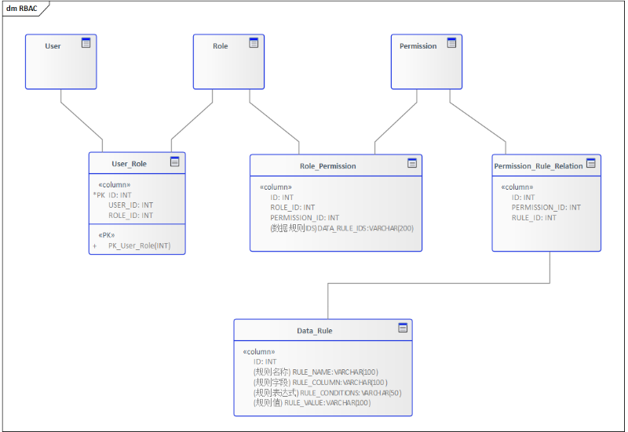

# [RBAC模型整合数据权限](https://my.oschina.net/u/1388595/blog/4967517)

在项目实际开发中我们不光要控制一个用户能访问哪些资源，还需要控制用户只能访问资源中的某部分数据。

控制一个用户能访问哪些资源我们有很成熟的权限管理模型即RBAC，但是控制用户只能访问某部分资源（即我们常说的数据权限）使用RBAC模型是不够的，本文我们尝试在RBAC模型的基础上融入数据权限的管理控制。

首先让我们先看下RBAC模型。


## RBAC模型

RBAC是Role-BasedAccess Control的英文缩写，意思是基于角色的访问控制。

RBAC事先会在系统中定义出不同的角色，不同的角色拥有不同的权限，一个角色实际上就是一组权限的集合。而系统的所有用户都会被分配到不同的角色中，一个用户可能拥有多个角色。使用RBAC可以极大地简化权限的管理。

RBAC模型还可以细分为RBAC0，RBAC1，RBAC2，RBAC3。这里我们不讨论他们之间的差异，感兴趣的同学可以自行研究，我们主要聚焦于常见的RBAC0模型上。

如下图就是一个经典RBAC0模型的数据库设计。

RBAC0

在RBAC模型下，系统只会验证用户A是否属于角色RoleX，而不会判断用户A是否能访问只属于用户B的数据DataB。这种问题我们称之为“水平权限管理问题”。


## 数据权限

列表数据权限，主要通过数据权限控制行数据，让不同的人有不同的查看数据规则；要实现数据权限，最重要的是需要抽象出数据规则。


### 数据规则

比如我们系统的商机数据，需要从下面几个维度来控制数据访问权限。

1. 销售人员只能看自己的数据；
2. 各大区的销售经理只能看各区域的数据（安徽大区的销售经理看安徽区域的商机数据），同理也适用于某BG分管领导只能看所在BG的商机数据；
3. 财务人员只能看金额小于一万的数据。

上面的这些维度就是数据规则。

这样数据规则的几个重点要素我们也明晰了，就是**规则字段**，**规则表达式**，**规则值**，上面三个场景对应的规则分别如下：

1. 规则字段：创建人，规则表达式：= ，规则值：当前登录人
2. 规则字段：所属大区，规则表达式：= ，规则值：安徽大区
3. 规则字段：销售金额，规则表达式：< ，规则值：10000

数据规则

```
规则字段配置说明： 
条件表达式：大于/大于等于/小于/小于等于/等于/包含/模糊/不等于
规则值：指定值 ( 固定值/系统上下文变量 )
```


### 关联资源、用户

光有数据规则是不够的，我们还需要把数据规则跟资源和用户进行绑定。

数据规则与资源的绑定很简单，我们只需要建立一个中间表即可，如下图所示：


这样资源就可以关联上了数据规则。

在应用设计上我们需要一个单独的数据规则管理功能，方便我们录入数据规则，然后在资源管理页面（比如商机列表）上就可以选择内置的数据规则进行资源与规则的绑定。

**「那么如何让不同的用户拥有不同的数据规则呢？」**

在RBAC模型中，用户是通过授予不同的角色来进行资源的管理，同理我们可以让角色在授予权限的时候关联上数据规则，这样最终在系统上就体现为不同的用户拥有不同的数据规则。

有点拗口，我们还是按上面的例子来说。

销售人员、大区销售经理、财务人员属于不同的角色，他们都拥有商机列表这个资源权限，但是在给这些角色绑定商机列表资源权限时我们可以勾选对应的数据规则（上面已经实现资源与数据规则的绑定）。体现在数据库设计中我们可以在角色资源对应关系表 `Role_Permission`中添加一个字段用于存储关联的数据规则，如果有多个数据规则可以使用分隔符分割。

最终RBAC模型演变成如下所示的模型：




按照上面的设计我们需要区分各个大区管理的数据权限则需要建立不同的大区角色，如安徽大区销售经理、上海大区销售经理，然后分别给角色勾选对应的数据规则。这里就类似于RBAC1中的角色继承的概念了。

这样我们就基本实现了RBAC与数据规则的绑定，但是我们还有个问题就是如何在系统中落地。

这里我们就要借助大名鼎鼎的AOP来实现了，这篇文章只讲原理不讲实现，所以我们只顺带提一下实现方案。

1. 自定义一个数据权限的注解，比如叫 `PermissionData`
2. 在对应的资源请求方法，比如商机列表上添加自定义注解 `@PermissionData`
3. 利用AOP抓取到用户对应角色的所有数据规则并进行SQL拼接，最终在SQL层面实现数据过滤。


## 继续优化

在上面的设计中我们通过给不同角色绑定不同数据规则实现了数据权限，但是考虑下面一种场景：某角色需要看到的数据范围为 “所属大区为安徽大区且事业部为消费者事业部的商机数据”，在这种场景里按照我们之前的设计需要建立两个数据规则：

1. 所属大区 = 安徽大区
2. 所属事业部 = 消费者事业部

然后再建立2个不同的角色，分别授予不同的数据规则，如果这样的场景比较多的话很容易出现角色爆炸的情况，所有我们这里再抽取出 **数据规则组** 的概念。

一个数据规则组有多个数据规则，数据规则之间通过 **AND** 进行连接，放一张应用设计图：


体现在数据库设计中就变成了如下所示：


##  小结

通过上面8张表的设计我们实现了RBAC模型与数据权限的结合，当然这里还有继续优化的空间。比如这里的规则字段和规则值我们可以抽取出对应的字典表，让数据规则表去关联这些字典字段，这样在应用层配置数据规则的时候就不需要管理员手动填写而是从字典项中去选择了，减少了数据规则配置出错的概率。

数据权限是一个实现相对比较复杂的功能，这里我们选择的是在RBAC模型基础上进行扩展，如果你有更好的解决方案欢迎留言告诉我。