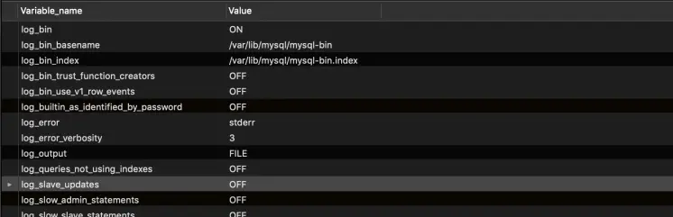
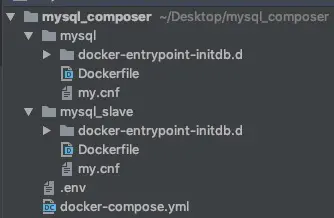

# docker 搭建Mysql 集群： 主从配置

mposer 快速搭建mysql服务。本篇文章将在原来的基础配置出，2台Mysql 服务器。一台作为Master 服务器，一台作为Slave 服务器。

### docker-composer.yml

```bash
version: '3'

networks:  #定义网路
  backend:
    driver: ${NETWORKS_DRIVER}

services:
  ### MySQL ################################################
  mysql-master:
    build:
      context: ./mysql  #自定义镜像
      args:
        - MYSQL_VERSION=${MYSQL_VERSION}
    environment:
      - MYSQL_DATABASE=${MYSQL_DATABASE}  #默认创建数据库
      - MYSQL_USER=${MYSQL_USER}  #创建用户
      - MYSQL_PASSWORD=${MYSQL_PASSWORD}  #用户密码
      - MYSQL_ROOT_PASSWORD=${MYSQL_ROOT_PASSWORD} #root 用户秘密
      - TZ=${WORKSPACE_TIMEZONE}
    volumes:
      - ${DATA_PATH_HOST}/mysql:/var/lib/mysql
      - ${MYSQL_ENTRYPOINT_INITDB}:/docker-entrypoint-initdb.d
    ports:
      - "${MYSQL_PORT}:3306"
    networks:
      - backend

  mysql-slave:
    build:
      context: ./mysql_slave  #自定义镜像
      args:
        - MYSQL_VERSION=${MYSQL_VERSION}
    environment:
      - MYSQL_DATABASE=${MYSQL_DATABASE}  #默认创建数据库
      - MYSQL_USER=${MYSQL_USER}  #创建用户
      - MYSQL_PASSWORD=${MYSQL_PASSWORD}  #用户密码
      - MYSQL_ROOT_PASSWORD=${MYSQL_ROOT_PASSWORD} #root 用户秘密
      - TZ=${WORKSPACE_TIMEZONE}
    volumes:
      - ${DATA_PATH_HOST}/mysql_slave:/var/lib/mysql
      - ${MYSQL_ENTRYPOINT_INITDB}:/docker-entrypoint-initdb.d
    ports:
      - "${MYSQL_PORT_SLAVE}:3306"
    networks:
      - backend
```

先给出完整版的docker-compose.yml。不过先把关注点放在`mysql-master` 这个服务上，`mysql-slave`先放一边，不去管他。
比对上一篇中的内容，`mysql-master`的配置没有变化，我们需要将`mysql-master`作为Master节点。主要的工作在于mysql目录下的my.cnf文件。

### 配置Master节点

修改后的my.cnf

```bash
# The MySQL  Client configuration file.
#
# For explanations see
# http://dev.mysql.com/doc/mysql/en/server-system-variables.html

[mysql]

[mysqld]
sql-mode="STRICT_TRANS_TABLES,NO_ZERO_IN_DATE,ERROR_FOR_DIVISION_BY_ZERO,NO_ENGINE_SUBSTITUTION"
character-set-server=utf8

## 主库配置
## 设置server_id，一般设置为IP,保证唯一就好
server_id=100
# 开启binlog，名字可以随意取
log-bin=mysql-bin
## binlog日志格式,（mixed,statement,row，默认格式是statement）
binlog_format=row
## 日志自动删除日期,默认值为0，表示不自动删除。
expire_logs_days=7
## 跳过主从复制中遇到的所有错误或指定类型的错误，避免slave端复制中断。
## 如：1062错误是指一些主键重复，1032错误是因为主从数据库数据不一致
slave_skip_errors=1062
## 复制过滤：也就是指定哪个数据库不用同步（mysql库一般不同步）
binlog-ignore-db=mysql
#控制binlog的写入频率。每执行多少次事务写入一次(这个参数性能消耗很大，但可减小MySQL崩溃造成的损失)
sync_binlog = 1
#这个参数一般用在主主同步中，用来错开自增值, 防止键值冲突
auto_increment_offset = 1
#这个参数一般用在主主同步中，用来错开自增值, 防止键值冲突
auto_increment_increment = 1
```

参数的意义备注都有说明了，着重讲解下以下几个

- log-bin : 用于开启binlog 日志功能，默认不开启，值为binlog日志文件名称可随自己喜欢定义。填写后就开启了binlog功能。
- binlog_format：文件格式。
- statement: sql语句形式，例如在Master 执行 `delete from student where id = 1。`那么binlog日志中也会如实记录这条信息。优点：占用空间少，缺点：误删则无法恢复数据，在某些情况下，可能造成主备不一致。
- row: 会记录数据信息，例如上面例子中会把id为1的学生信息也记录下来。优点：可以找回误删的信息，可以避免主备不一致的情况，缺点：占用空间大。
- mixed：混合statement,row。 Mysql 会判断哪些语句执行可能引起主备不一致，这些语句采用row 格式记录，其他的使用statement格式记录。当然这种形式的日志也没有办法恢复误删的数据。
- 在服务器配置较好的情况下，建议使用row。阿里云上RDS服务，默认也是使用row格式。
- expire_logs_days： 设置binlog保存时间，默认为0，也就是随着服务器运行，binlog会越来越大。看业务需求来配置binlog保存时间吧。结合每日的数据库备份功能，通过binlog，可以支持将数据库回溯到N天的任意时间点。
- sync_binlog：默认，sync_binlog=0，表示MySQL不控制binlog的刷新，由文件系统自己控制它的缓存的刷新。这时候的性能是最好的，但是风险也是最大的。一旦系统崩溃, binlog_cache中的所有binlog信息都会被丢失。设置为1表示每次事务提交都需要写入磁盘。也可以设置为2，3..N标识 N次事务提交写入磁盘。Master 节点一般设置为1,保证binlog日志不丢失。

#### 修改完成后，启动Master节点服务

```bash
docker-compose up -d --build mysql-master
```

`--build`参数可以让镜像强制重新生成。
查看Master服务binlog情况

```sql
show VARIABLES like 'log_%';
```

展示内容如下：




看到`log_bin`为ON。

#### 创建用于主从同步的账号：

```sql
grant file,select,replication slave on *.* to 'slave'@'%' identified by '123456';
复制代码
```

这里'slave'@'%' 让slave 可以在任何机器都可以登录，当然如果知道Slave节点IP ，建议使用IP，增加账号安全性。

#### 查看Master状态

```sql
show master status;
复制代码
```


有用的字段是File,和Position记录下来。

### 配置Slave节点

复制mysql 目录 生成一个mysql_slave目录，改后目录结构为




修改mysql_slave下的my.cnf

```bash
# The MySQL  Client configuration file.
#
# For explanations see
# http://dev.mysql.com/doc/mysql/en/server-system-variables.html

[mysql]

[mysqld]
sql-mode="STRICT_TRANS_TABLES,NO_ZERO_IN_DATE,ERROR_FOR_DIVISION_BY_ZERO,NO_ENGINE_SUBSTITUTION"
character-set-server=utf8

## 从库配置
## 设置server_id，一般设置为IP,保证唯一就好
server_id=101
# 开启binlog，名字可以随意取
log-bin=mysql-slave-bin
## binlog日志格式,（mixed,statement,row，默认格式是statement）
binlog_format=row
## 日志自动删除日期,默认值为0，表示不自动删除。
expire_logs_days=7
## 跳过主从复制中遇到的所有错误或指定类型的错误，避免slave端复制中断。
## 如：1062错误是指一些主键重复，1032错误是因为主从数据库数据不一致
slave_skip_errors=1062
## 复制过滤：也就是指定哪个数据库不用同步（mysql库一般不同步）
binlog-ignore-db=mysql

#牺牲一定可靠性，加强并发能力
sync_binlog = 0
innodb_flush_log_at_trx_commit = 0

## 只读
read_only=1
```

和Master 项目比：

- `sync_binlog 和 ``innodb_flush_log_at_trx_commit 设置为0，`加快事务处理速度，牺牲了一定的可靠性。由于Slave 是Master 的备份，所以即使Slave 服务崩溃或者断点丢失数据，也可以重新启动后从主库恢复。
- read_only ：设置为只读，防止不必要的修改。 主备同步线程具有管理员权限，不受read_only控制，所以能够正常写入。

#### 启动Slave节点

```bash
docker-compose up -d --build mysql-slave
```

mysql-slave节点在.env中，我配置成了3309端口。
服务启动后，连接上Slave节点,设置Master 信息：

```bash
change master to master_host='mysql-master',master_user='slave',master_password='123456',master_log_file='mysql-bin.000001',master_log_pos=1311;
```

- master_host ： 为主节点IP, 由于我们mysql-master 和msql-slave都在同一个backend网路中，所以可以通过mysql-master名称访问到。docker 帮我们做了host解析。
- master_user ： 刚刚创建的用于同步的账号
- master_password： 登录密码
- master_log_file： 就是Master 要同步的binlog文件。
- master_log_pos：从binlong哪个文件位置开始同步。

简单来说Slave 服务器，通过master_log_file和master_log_pos 两个参数知道自己通过Master中的哪个binlog信息开始同步。

```sql
stop slave;
start slave;
```

开启同步，查看同步信息

```bash
mysql>SHOW SLAVE STATUS\G
*************************** 1. row ***************************
             Slave_IO_State: Waiting for master to send event
                Master_Host: mysql-master
                Master_User: slave
                Master_Port: 3306
              Connect_Retry: 60
            Master_Log_File: mysql-bin.000001
        Read_Master_Log_Pos: 1311
             Relay_Log_File: aee031481732-relay-bin.000002
              Relay_Log_Pos: 232
      Relay_Master_Log_File: mysql-bin.000001
           Slave_IO_Running: Yes
          Slave_SQL_Running: Yes
            Replicate_Do_DB:
        Replicate_Ignore_DB:
         Replicate_Do_Table:
     Replicate_Ignore_Table:
    Replicate_Wild_Do_Table:
Replicate_Wild_Ignore_Table:
                 Last_Errno: 0
                 Last_Error:
               Skip_Counter: 0
        Exec_Master_Log_Pos: 1311
            Relay_Log_Space: 1401
            Until_Condition: None
             Until_Log_File:
              Until_Log_Pos: 0
         Master_SSL_Allowed: No
         Master_SSL_CA_File:
         Master_SSL_CA_Path:
            Master_SSL_Cert:
          Master_SSL_Cipher:
             Master_SSL_Key:
      Seconds_Behind_Master: 0
```

`Slave_IO_Running 和 Slave_SQL_Running` 两列的值都为"Yes"，这表明 Slave 的 I/O 和 SQL 线程都在正常运行。
`Seconds_Behind_Master`表示延迟多少，一般情况为0

### 结语

通过今天的配置，我们搭建了2台Mysql 服务器，一台Master ,一台Slave。了解binlog日志的不同格式，以主从服务器为了效率不同的配置信息。下一篇将讲解怎么做`双主`。

[docker 搭建Mysql 集群：使用composer 启动Mysql服务](https://juejin.im/post/5e1489b55188253a59093a64)