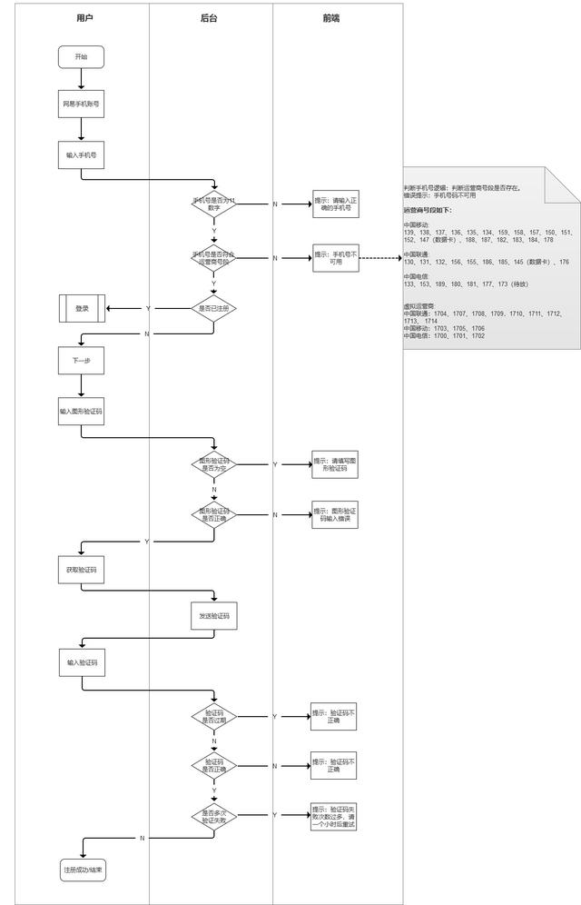

# 业务流程图

> 业务流程图是产品狗在工作中最常用的，但也是最容易被忽略的，业务流程图就像产品界的西红柿炒鸡蛋，人人都会炒，但不是人人都炒的好吃，这篇文章将从两个方面来解读如何画出一份合格的业务流程图。

## 一、业务流程基础知识

### 1.1 什么是业务流程图

任何一件事儿都是有流程的，就像你炒盘菜，你需要买菜、择菜、洗菜、炒菜、装盘。比如我们要设计一个用户注册的功能，那用户需要走的路径就是注册的流程。

在产品设计中，业务流程图就是一个过程文件，就好比是我们建大楼的建筑图纸，产品设计说白了就是流程设计，凡是产品需求必需要有流程图，要不然很容易出问题；

如果你想做一名合格的产品经理，必须要有画流程图的能力，这样在需求评审时，跟研发大大PK的能力也大大提升。如果你的流程图没有问题，后面的页面流程图、原型、需求文档及需求评审都会问题不大。

### 1.2 基本的业务流程图包括什么？

1. 事项：要做什么事情，用户进来的目标是什么？
2. 用户：什么样的用户会走这个流程？
3. 信息：从开始到结束，这条数据是怎么跑的？
4. 出问题了怎么处理？

下面我拿网易蜗牛读书的登录功能的业务流程图做一下解析：

图1

事项，是用户要完成登录的流程，他进来的目标是要登录网易蜗牛读书。

用户，是想登录的老用户，新用户一般会走注册流程。

信息，输入网易手机账号和手机号，输入密码或验证码，最后登录成功。

异常怎么办？输入手机号是否为11位的正确手机号，如不是，提示：请输入正确的手机号，如果是验证码登录，输入图形验证码，后台判断是否正确，如果不正确，无法获取短信验证码，并提示：图形验证码输入错误，如果正确，获取短信验证码，输入短信验证码，再校验短信验证码是否正确，不正确给予提示，这是异常的流程及处理方法。

### 1.3 画业务流程图有哪些规则？

有很多刚入行的产品童鞋都喜欢把业务流程图画的五颜六色，流程图的形状也用的各式各样的，比如我有位小可爱同事就是这样子的，问她为啥这样画，她说，这样子多好看啊。你那样子画太单调了（我是平静脸）。

小可爱的业务流程图

那如何规范的画一份业务流程图呢？下面我罗列出了部分常用的业务流程符号和它们所表示的是啥：

## 二、案例：业务流程图怎么画？

下面我们以 「网易蜗牛读书-网易手机账号」 注册为例来说说，单通道的业务流程图怎么画。

### 2.1 单通道的业务流程图怎么画？

第一步：要明确用户及其需要完成什么样的事情：用户是需要用手机账号注册的用户，任务呢，是要完成注册的过程。

第二步：要明确开始和结束分别是什么：开始是输入手机号，那结束呢是完成。

第三步：要明确流程的先后顺序，顺序决定了用户体验好不好：它的先后顺序是点击网易手机账号-输入验证码-判断有没有注册过，如果没有，再输入图形验证码-获取手机验证码-输入验证码，最后注册成功。这基本上是一个核心的流程。

第四步：会出现哪些异常，这些异常出现了，要怎么办？：异常就是手机号是否已经注册，是否正确。图形验证码是否正确。短信验证码是否正确，是否过期。这里是两个不同的维度，如果错误，就回到重新填写验证码步骤，如果过期 ，就重新获取验证码。

第五步：去优化和调整你的业务流程图：比如：用户点击“网易手机账号”，你是需要默认勾选“同意服务条款和隐私条款”，还是需要用户自己去勾选？这里当然是默认勾选更好一点，减少了用户操作步骤。

第六步：输出你的流程图，结合自己的工作方式输出到文档里或原型或邮件等等。

### 2.2 复杂的业务流程图怎么画？

复杂的流程很难表达清楚，这里我们需要进行角色的拆分了。做复杂的业务流程图会用到泳道图，可以突出用户操作、后端系统、前端页面之间的逻辑关系，以及如何运作。

第一：分析功能的关键逻辑：看都有什么人参与到功能里面，这些人分别扮演了什么角色，分别要做什么事情。不同角色要完成的任务是不一样的。

第二：明确用户与任务：明确所有参与用户与系统，系统也作为一个参与角色。这些参与者之间有什么关系，是上下级关系，还是上下游关系。所有参与者，最终的目标是什么？

第三：明确开始与结束的路径：每个功能模块中，从哪里开始，到哪里结束，一般开始和结束只有一个，如果结束太多的话，就意味着用户会懵掉。有些功能流程还需要区分一下时间段，比如跑腿业务，它分下单前、下单中、下单后等。

第四：确定功能模块与核心路径：有哪些功能模块会参与到这个流程中，流程中核心流向一定要清晰。如果核心流程不清晰，用户一定会懵。

第五：不断调整优化流程图顺序，合并异常流程：异常流程考虑清楚，尽可能的细化。

第六：合并或拆分流程有依据：先复杂后简单，先加法后减法，把能想到的都梳理出来，然后再调研相关产品，进行合并、分析。

### 2.3 业务流程图有哪些规范呢？

1. 流程图的形状、颜色、字号要统一，每个流程都要有开始和结束，而流程图中只能有一个开始，结束可以有多个，但是最多别超过3个。
2. 流程图应该从形状的左端或上端注入，从右端或下端流出，从左到右、从上至下的排列，而且连接线不可以交叉。
3. 除了有判断，否则流程图的箭头不可以有回调，而每个判断只有两种结果：是和否。

### 2.4 画流程图都用哪些工具？

Windows系统可以用：Axure rp9、Visio、Mindjet MindManager 2019等；

Mas OS系统可以用：Axure rp9、OmniGraffle 7、My Draw、Edraw等；还有一些在线的像Process On、MindFlow、AsciiFlow等等。