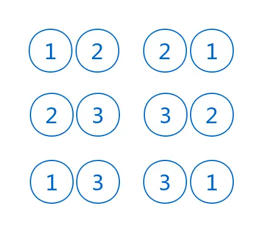

# 人人都要懂点统计学：统计学简明教程

统计学被人称为猜测上帝的游戏，随着大数据和机器学习的发展，统计学的应用前景更加广阔，也带火了统计学专业，让相关从业人员获得了超额回报。即便，并不是所有人都要从事数据分析、机器学习等领域，但懂点统计学对于每个人的工作、生活都有莫大的帮助。

对炒股有所了解的朋友，应该听说过量化投资，量化投资是指通过数量化方式及计算机程序化发出买卖指令，以获取稳定收益为目的的交易方式。其中最具代表性的人物就是：**詹姆斯·西蒙斯**，一位世界级的数学家，从1898到2007年间的平均收益率高达35%，其秘密武器就是量化投资。而量化投资与统计学的关系最为密切，通过这一事例，可见统计学的巨大价值。

本文希望能够帮助大家，简明扼要地了解统计学的知识体系，掌握统计学的分析技巧，将统计学的思想融入的工作和生活中。

不管在什么领域，收集数据进行分析都是得到最快、最好答案的方法，数据中会隐含着一些趋势和模式，可以分析其因果关系。

## 基础指标

**平均值**，是了解数据中心所在，根据数据分布的不同特点，可以分别计算3种指标：

- 均值：在数据非常对称，且仅显示出一种趋势时使用
- 中位数：在数据由于异常值而发生偏斜时使用
- 众数：在遇到类别数据（可以分为两个或更多组）时使用

上图的数据非常对称，均值、中位数、众数都为5。

上图的数据正偏态，均值约为4.15，中位数为4，众数为2。

上图的数据负偏态，均值约为5.85，中位数为6，众数为8。

受到数据分布特点不同的影响，均值、中位数和众数会发生变化。如果是骰子赌点数，那么就可以判断骰子是否公平：

- 当 *均值 = 中位数 = 众数* 时，数据满足正态分布
- 当 *均值 > 中位数 > 众数* 时，数据满足正偏分布
- 当 *均值 < 中位数 < 众数* 时，数据满足负偏分布

因此通过均值、中位数和众数，我们就能判断出数据分布特点。

**各种距和差**，描述数据的分散或变异情况，可以分别计算5种指标：

- 全距（极差）：描述数据的宽度，数据中的最大数减去最小数
- 四分位距：将数据一分为4，最小的四分位数称为下四分位数（），最大的四分位数称为上四分位数（），中间的四分位数称为中位数（）
- 箱线图：是利用数据中的五个统计量，最小值、第一四分位数、中位数、第三四分位数和最大数
- 方差、标准差：量度与均值的距离，数据的分散性
- 标准分：可以把这些数值视为来自同一个数据集或数据分布，从而进行比较距离均值的标准差个数

全距及四分位距的可视化图形展示：

箱线图的可视化图形展示：

通过观察“箱线图”不难发现，这与股票行情的K线图类似，都是可以直观地反映出数据的分散程度。

方差的计算公式：

%20%3D%20%5Csigma%5E%7B2%7D%20%3D%5Cfrac%7B1%7D%7BN%7D%20%5Csum_%7Bi%3D1%7D%5EN%20(x_i%20-%20%5Cmu)%5E2%20%0A%3D%20%5Cfrac%7B1%7D%7BN%7D%20%5Cleft(%5Csum_%7Bi%3D1%7D%5EN%20x_i%5E2%20-%20N%5Cmu%5E2%20%20%5Cright))

其中，是数据集，是数据集的均值，反映出了数据集离均值的距离，也就反映出了数据的离散程度，而标准差就是方差开根号，即。

标准分的计算公式：

其中，是需要被标准化的原始数据，是数据集的均值，是数据集的标准差，且。标准分是数据标准化的一种方法，对数据进行伸缩变换，使得不同维度的数据具有可比性，同时不改变原始数据的分布。

另外还有一种数据伸缩变换的方法 —— **归一化**，使得不同维度的数据的影响权重是一致的，但会改变原始数据的分布。

## 排列组合

假设，我们有3个小球，编号从1到3，如下图所示：

我们从这3个小球中，选取出2个小球，并排序，结果是6种情况，如下图所示：

这就是**排列**，是指从给定个数的元素中取出指定个数的元素，并进行排序，其计算公式：

!%7D%7D)

还是从这3个小球中，选取出2个小球，但不排序，结果是3种情况，如下图所示：

这就是**组合**，是指从给定个数的元素中取出指定个数的元素，但不排序，其计算公式：

!%7D%7D)

相对来说，从计算公式来看，组合要比排列更抽象一些。所以，大家可以先理解排列，再去理解组合。

## 概率

用一个流传已久的笑话，来解释概率的概念：有一个病人去医院看病，遇到了一个医生，经过检查之后，医生告诉病人：“你的病九死一生，但多亏遇到了我，因为在你之前，我已经看了九个得一样病的人都死了，而你是第十个一定能治好，妥妥的。”

一看就是知道，这是一个糊涂医生，虽然懂点概率，却没有领悟概率的真谛。

生活中充满了随机性，比如：投掷硬币、赌骰子等等，一个随机事件的概率，是一个介于0到1之间实数，概率是用来量度随机事件发生的可能性。

数学表达式如下：

![P(A) \in [0, 1]](https://juejin.im/equation?tex=P(A)%20%5Cin%20%5B0%2C%201%5D)

其中，表示随机事件。如果令表示非事件，那么有如下数学公式：

%20%2B%20P(A%5Ec)%20%3D%201)

也可以用文氏图（维恩图）来表示，如下图所示：

大多数情况下，我们是通过样本数据来计算概率值，比如：独立投掷100次硬币，统计正面向上的次数为59次，因此，硬币正面向上的概率为0.59。

数学计算公式如下：

%20%3D%20%5Cfrac%7Bn(A)%7D%7Bn(S)%7D)

其中，)表示事件的次数，)表示全部事件的次数。可以这样理解，每一局赌局称为一个事件，每一局赌局的结果称为一个观测值，独立观测值。

除了一个事件外，还存在其它事件，因此，就有了**互斥事件**和**独立事件**。

互斥事件，是指互不相容事件，也可以说是不可能同时发生的事件，比如：硬币的正反面。而独立事件，是指一个事件的发生，另一个事件也可能发生，比如：阴天的时候可能下雨，也可能不下雨。

这样就有了“或”、“和”的情况，计算公式如下：

其中，)是条件概率，也就是贝叶斯定理，计算公式如下：

%3D%7B%5Cfrac%20%7BP(A%5Ccap%20B)%7D%7BP(B)%7D%7D%3D%7B%5Cfrac%20%7BP(B%7CA)P(A)%7D%7BP(B)%7D%7D)

## 概率分布

现在，我们已经了解了概率的基础知识，而概率中的随机事件可以称为随机变量，包含**离散型**随机变量和**连续型**随机变量。

离散型随机变量，是由一个个单独的数值组成，其中的每一个数值都有相应概率，数值型数据，只能取确切值。

连续型随机变量，是值如果随机变量的所有可能取值不可以逐个列举出来，而是取数轴上某一区间内的任一点的随机变量。

概率分布，用以表述随机变量取值的概率规律，不同类型的随机变量有不同的概率分布形式，比如：伯努利分布、正态分布等等，表达一个概率分布需要两个重要参数：期望和方差。

> 期望，指示预测结果，当成均值一样就行。

本文主要介绍几种比较常用的概率分布。

### 离散型概率分布

#### 伯努利分布

若伯努利试验成功，则伯努利随机变量取值为1；若伯努利试验失败，则伯努利随机变量取值为0。记其成功概率为)，失败概率。

期望：

![{\displaystyle \operatorname {E} [X]=\sum _{i=0}^{1}x_{i}f_{X}(x)=0+p=p}](https://juejin.im/equation?tex=%7B%5Cdisplaystyle%20%5Coperatorname%20%7BE%7D%20%5BX%5D%3D%5Csum%20_%7Bi%3D0%7D%5E%7B1%7Dx_%7Bi%7Df_%7BX%7D(x)%3D0%2Bp%3Dp%7D)

方差：

![{\displaystyle \operatorname {var} [X]=\sum _{i=0}^{1}(x_{i}-E[X])^{2}f_{X}(x)=(0-p)^{2}(1-p)+(1-p)^{2}p=p(1-p)=pq}](https://juejin.im/equation?tex=%7B%5Cdisplaystyle%20%5Coperatorname%20%7Bvar%7D%20%5BX%5D%3D%5Csum%20_%7Bi%3D0%7D%5E%7B1%7D(x_%7Bi%7D-E%5BX%5D)%5E%7B2%7Df_%7BX%7D(x)%3D(0-p)%5E%7B2%7D(1-p)%2B(1-p)%5E%7B2%7Dp%3Dp(1-p)%3Dpq%7D)

#### 二项分布

二项分布，是你正在进行一系列独立试验，每一次试验都存在失败和成功的可能，每一次试验的成功概率相同，试验次数有限，随机变量表示，次试验中的成功次数。就是将伯努利试验重复次后的概率分布。

期望：

![\operatorname {E} [X]=np](https://juejin.im/equation?tex=%5Coperatorname%20%7BE%7D%20%5BX%5D%3Dnp)

方差：

![\operatorname {var} [X]=np(1-p)](https://juejin.im/equation?tex=%5Coperatorname%20%7Bvar%7D%20%5BX%5D%3Dnp(1-p))

#### 几何分布

几何分布，是指进行一系列相互独立的试验，每一次试验都既有成功的可能，也有失败的可能，且单次试验的成功概率相同，主要感兴趣的是，为了取得第一次成功需要进行多少次试验。变量表示为了取得第一次成功所需进行的试验次数。

期望：

![{E} [X]={\frac{1}{p}}](https://juejin.im/equation?tex=%7BE%7D%20%5BX%5D%3D%7B%5Cfrac%7B1%7D%7Bp%7D%7D)

方差：

![{var} [X]={\frac  {1-p}{p^{2}}}](https://juejin.im/equation?tex=%7Bvar%7D%20%5BX%5D%3D%7B%5Cfrac%20%20%7B1-p%7D%7Bp%5E%7B2%7D%7D%7D)

### 连续型概率分布

#### 正态分布

正态分布，又称高斯分布，是一个非常常见的连续概率分布，若随机变量服从一个位置参数为，分散参数为的正态分布，记为：)。

概率密度函数为：

%3D%7B%5Cfrac%20%7B1%7D%7B%5Csigma%20%7B%5Csqrt%20%7B2%5Cpi%20%7D%7D%7D%7D%5C%3Be%5E%7B-%7B%5Cfrac%20%7B%5Cleft(x-%5Cmu%20%5Cright)%5E%7B2%7D%7D%7B2%5Csigma%20%5E%7B2%7D%7D%7D%7D%5C!%7D)

正态分布的期望就是，而方差就是。

## 总结

本文是一份简明的统计学教程，从基础指标到排列组合，从概率到概率分布，我们过了一遍统计学的知识体系，可以在头脑中形成一个清晰的知识框架。在工作和生活中，可以继续不断加深理解，不断扩充知识面，培养成统计思维，会发现另一个世界。

如果以上内容对你有所帮助，希望你能够点赞、评论、转发。最后，安利大家一本我写掘金小册[《深入理解NLP的中文分词：从原理到实践》](https://juejin.im/book/5d9ea8fff265da5b81794756)，里面有关于统计学在中文分词中的应用，让你可以更直观地理解统计学，同时，让你从零掌握中文分词，踏入NLP的大门。