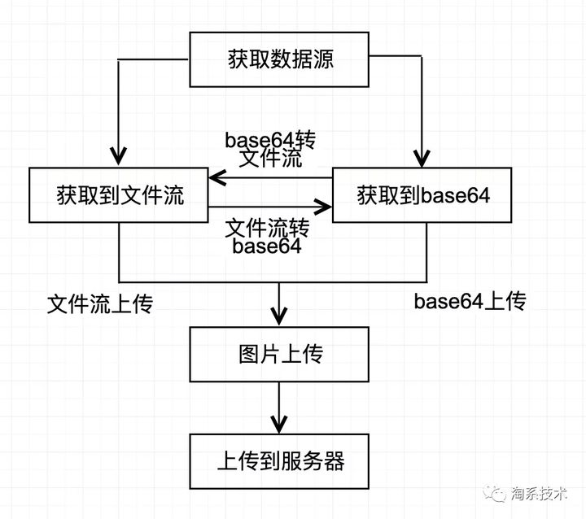
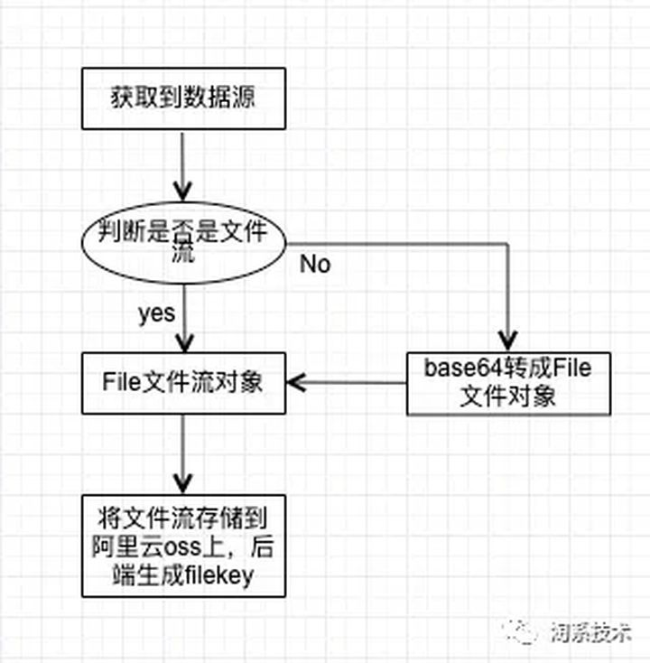
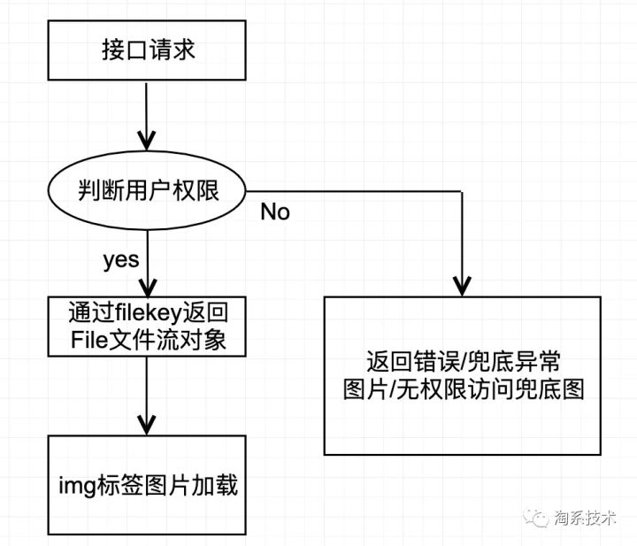
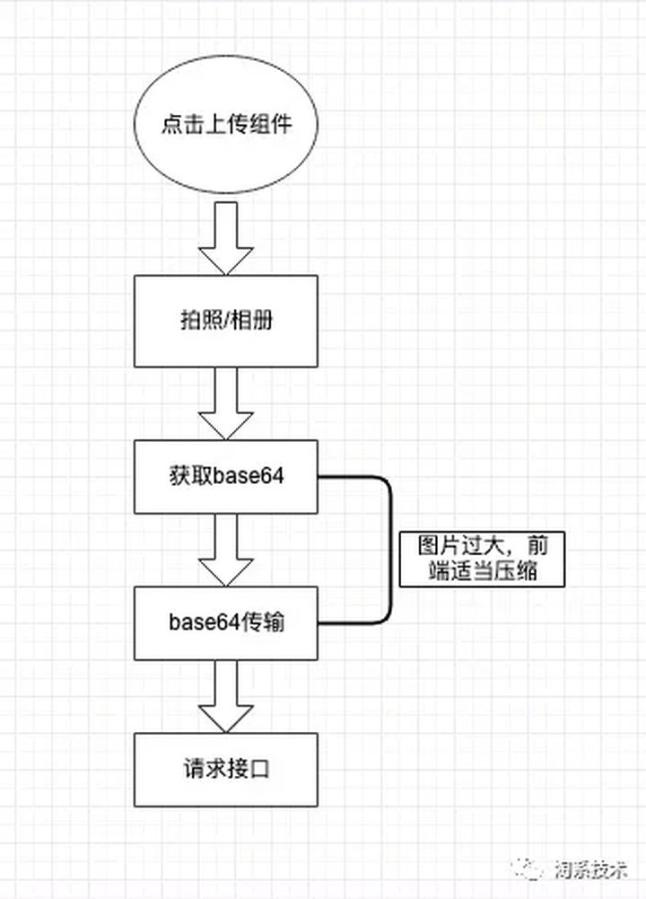

# 图片上传系统在淘系中的实践

传统图片信息的上传渠道一般在pc端的后台或者客户端上直接上传，但是如何在移动端的webview上快速上传图片，并保证图片安全下载这一直是一个挑战。

## **名词解释**

- 阿里云oss：阿里云对象存储OSS（Object Storage Service）是阿里云提供的海量、安全、低成本、高持久的云存储服务，在本文中用于存储图片。

- 文件流：二进制文件流。

- base64：图片的base64二进制。

  

## **整体技术方案**

### **▐** **前端整体图片上传流程图**



**▐ 后端图片存储及图片安全返回**



服务端到拿到文件流存储到oss上后，oss会提供一个临时的文件访问url，服务端拿到链接就可以做非常多的操作了，比如图片识别，图片解析，图片裁剪，图片选装等等。

阿里云的oss在图片安全问题上也提供了一些能力，比如过期时间，你可以设定一张图片访问的有效时间，比如5分钟后图片访问就失效了，这种情况能解决大部分图片安全问题，但对于一些特殊需求，比如懒加载的图片，feeds流里的图片这种在不确定什么时间才加载的图片，就会出现问题。所以这里提出图片和用户绑定，对图片进行用户权限的校验：



## **前端方案**

### **▐ 初期方案**

经过调研和技术选型，我们初步选择使用文件流的传输方式，通过http接口传输，直接把文件流打到后端服务，然后后端去把文件流存储到阿里云的oss上，这套方案在pc端实现良好，但是到了移动端，为了更好的样式和体验，通过唤起相册或者拍照的方式，只能获取到图片的base64，而无法直接获取文件流（标准input标签也能打开相册或拍照，但是是系统级别的行为，样式和交互方式不可控）。所以只能通过将base64转成文件对象去上传，这样从理论上可以和pc端保持一致，并通过获取base64的image/***来获得数据类型和自定义后缀，自定义文件名称后传入到filename参数：

```text
dataURLtoFile('data:image/png;base64,iVBORw0KGgoAAAANSUh........', 'test.png');

function dataURLtoFile(base64String, filename) {

    var arr = base64String.split(','),
        mime = arr[0].match(/:(.*?);/)[1],
        bstr = atob(arr[1]), 
        n = bstr.length, 
        u8arr = new Uint8Array(n);

    while(n--){
        u8arr[n] = bstr.charCodeAt(n);
    }
    let file = new File([u8arr], filename, {type:mime});
    return file;
}
```

到这里一切都很完美，pc端可以通过input标签获取file对象直接上传到对应接口，移动端通过base64转换成File对象在上传到对应接口，使用一个接口就能同时打通pc端和移动端，但是在测试的时候抓包出现问题了。

由于我所使用的端内webview测试环境发现其对Formdata兼容性不强，文件名经常打不上去，文件名全部变成了file，并且文件大小变成0Kb，从而导致后端无法直接拿文件流。


### **▐** **方案迭代**

### **规避端内formdata兼容问题**

在接下来的文件上传相关的资料学习和写demo尝试中发现，base64本身就是个字符串，可以将其上传至服务器端，让服务器端来处理文件并上传至阿里云的oss上。


### **File对象后移**

既然前端在移动端webview里无法正常传输js生成的File对象，那么把FIle对象的生成环节移到服务端去生成，不就可以了，毕竟双端环境(Android、Ios)对于base64字符串传输还是友好的，但是由于base64比文件流是要大的，所以这里会在传输过程上造成一定的时间和资源的消耗。具体方案如下：



通过客户端的能力获取相册图片的base64，然后对base64进行大小压缩的处理，demo如下：

```text
/**
 * 对图片进行压缩处理
 * @param base64String 源图片base64
 * @param maxSize 可以设置成1M = 1024 * 1024 = 1048576，这里根据自己业务调整
 * 图片base64和文件流之间大小可以参考：https://juejin.cn/post/6913814643618086925
 */
function processImage(base64String, maxSize, scale = 1) {
  const canvas = document.createElement('canvas');
  const context = canvas.getContext('2d');

  const source = new Image();
  source.onload = () => {
     let sw = source.width * scale;
    let sh= source.height * scale;

    canvas.width = sw;
    canvas.height = sh;

    context.drawImage(source, 0, 0, sw, sh);

    const imageBase = canvas.toDataURL('image/jpeg', 0.85);
    if (imageBase.length > maxFileSize) {
      processImage(imageBase, maxSize, 0.7);
      return;
    }
    uploader(imageBase);
  };
  source.onerror = () => {
    return base64String
  };
  source.src = base64String;
}
```

拿到处理后的base64，接下来就需要把对应的base64传递到后端，为了和浏览器端使用同一个上传接口，前端这边采用multipart/form-data上传类型的上传方式：

```text
function uploader(base64string) {
   const xhr = new XMLHttpRequest();
    xhr.withCredentials = true; // 开启同源策略，避免因为多级域名不同而导致cookie缺失
    const fd = new FormData();
    fd.append('imgBase64Str', base64string);
    fd.append('xxx', 'xxx');
    .
    .
    .
    xhr.open('POST', 'XXXXX', true);
    xhr.onreadystatechange = function() {
      if (xhr.readyState == 4 && xhr.status == 200) {
           console.log('I get it')
      }
    };
    xhr.send(fd);
}
```

最后通过阿里云的oss查看、下载接口等方案验证后都正常。

如何同时打通pc端也适用这套上传体系呢？

后端可以新增个字段来判断当前获取到的是base64还是文件流。由于阿里云oss都是直接上传文件流，pc端可以直接获取文件流，那么可以减少了后端把base64转文件流的成本，拿到就直接上传到oss上！

```text
const reader = new FileReader();
    reader.readAsDataURL(file); // file => input里的File对象
    reader.onload = () => console.log(reader.result);
    reader.onerror = error => console.log(error);
```

## **后端实现方案（JAVA）**

### **▐** **提供controller作为http入口**

目前的测试应用框架是基于spring boot(PandoraBoot)的，所以可以直接写@Controller注解的类接收http请求。


### **▐** **如果跨域，针对跨域的支持**

在Controller类的方法上增加：

@CrossOrigin(origins = {"[https://xxxx.com](https://link.zhihu.com/?target=https%3A//xxxx.com)", "[https://xxx.com](https://link.zhihu.com/?target=https%3A//xxx.com)"})

就可以提供对跨域访问的支持，依次来提供不同应用的域名访问图片的诉求。origins里可以写多个域名。


### **▐** **上传文件使用MultipartFile的方式**

方法的定义为：

```text
@CrossOrigin(origins = {"https://test.com", "https://test1.com"})
@RequestMapping(value = "/pathname/result", method = 
RequestMethod.POST)
@ResponseBody
public TestResult<FileUploadResponse> uploadOssFile(@RequestParam MultipartFile file, 
@RequestParam(value = "test") String Test, 
 HttpServletRequest request, HttpServletResponse response){
}
```

其中TestResult和FileUploadResponse都是自定义的数据结构。

如果是这种方式，则获取file.getInputStream()后直接传到阿里云的oss上即可，阿里云的oss上传接口：

ossClient.putObject(bucketName, fileKey, inputStream);


### **▐** **不使用MultipartFile的方式上传图片**

一般来说MultipartFile就能满足大多数需求了,对于PC浏览器来说MultipartFile就是标准的上传文件的方式。

但是我们的情况有些特殊，端上获取手机本地的图片文件后无法用MultipartFile传给后端，后端http接口接收到file后内容一直是空，这个问题一直没有得到解决，所以针对图片上传就使用了base64编码的方式，简单来说就是前端先把图片转成base64编码后的一个很长的字符串，然后把这个字符串作为参数传给后端。

方法的定义变成了：

```text
@CrossOrigin(origins = {"https://test.com", "https://test1.com"})
@RequestMapping(value = "/pathname/result", method = RequestMethod.POST)
@ResponseBody
public AliAutoResult<FileUploadResponse> uploadOssFile(@RequestParam String imgBase64Str,
                                                      @RequestParam(value = "test") String Test,
                                                      HttpServletRequest request, HttpServletResponse response){
                                                      }
```

其中imgBase64Str就是图片编码后的字符串，因为长度太长了(稍微大点的图片编码后字符串长度就超过1M了)，springboot默认POST传参的大小为1M，为了突破这个限制，需要做如下配置：

```text
# POST上传文件大小限制
server.tomcat.max-http-post-size = -1
spring.http.multipart.maxFileSize = 50Mb
spring.http.multipart.maxRequestSize = 100Mb
```

### **▐** **对imgBase64Str的处理** 

收到base64编码的字符串后，需要将这个字符串解码后，再作为文件流的形式存储到oss上。

先将imgBase64Str转储为本地临时文件：

```text
//获取临时文件
File file = makeTempFile(imgBase64Str);

/**
     * 将上传的文件先在本地生成临时文件
     *
     * @return
     */
    private File makeTempFile(String imgBase64Str) {
        //解析文件类型
        String base64Header = imgBase64Str.substring(0, imgBase64Str.indexOf(";base64,") + 8);
        String fileType = base64Header.substring(base64Header.indexOf("/") + 1, base64Header.indexOf(";"));
        log.warn("base64Header={};fileType={}", base64Header, fileType);
        //去掉头部
        String imgBase64 = imgBase64Str.replace(base64Header, "");
        //生成临时文件
        File file = new File(FILE_NAME + fileType);

        try {
            // Base64解码
            BASE64Decoder decoder = new BASE64Decoder();
            byte[] bytes = decoder.decodeBuffer(imgBase64);
            for (int i = 0; i < bytes.length; ++i) {
                if (bytes[i] < 0) {
                    // 调整异常数据
                    bytes[i] += 256;
                }
            }
            // 生成图片
            OutputStream out = new FileOutputStream(file);
            out.write(bytes);
            out.flush();
            out.close();
        } catch (Exception ex) {
            log.error("makeTempFile|Exception:", ex);
            return null;
        }

        return file;
    }
```


然后使用FileInputStream将file传到oss上:

```text
FileInputStream fileInputStream = new FileInputStream(file);
ossClient.putObject(bucketName, fileKey, fileInputStream);
```


至此，上传工作已经完成。

临时文件使用完成后记得删除哦。

也有方案说直接操作stream即可，但本人在这里没做尝试，有兴趣的读者可以去尝试一下。


### **▐** **图片文件下载**

我们要如何将图片的安全性做到一定程度，避免被他人恶意传播与利用，首先我们需要把图片分私有和共有，私有即只有特定的用户，比如上传者，后台审核人员等拥有对应业务标记身份的人可以访问，共有即不设置访问权限，所有用户都可以访问到这张图片。这样通过一些手段让非对应权限的人无法访问到这些信息流，从而达到对图片的泄露做到保护。


### **共有图片处理方案**

如果是公有的业务背景下直接返回图片存储在服务器或cdn上的链接即可。


### **私有图片技术方案**

如果是私有的图片，那么后端会提供一个有逻辑的http接口。例如：

https://localhost/path?xxx=xxx&fileKey=${fileKey}

服务器接口通过解析接口的参数fileKey，然后通过访问的用户是否具备对这个filekey所对应图片有访问权限来决定是否返回对应图片的文件流。

```text
@CrossOrigin(origins = {"https://test.com", "https://test1.com"})
    @RequestMapping(value = "/pathname/result", method = RequestMethod.GET)
    @ResponseBody
    public void downloadOssFile(@RequestParam(value = "fileKey") String fileKey,
                                @RequestParam(value = "process", required = false,
                                    defaultValue = "") String process,
                                HttpServletRequest request, HttpServletResponse response)
```

根据fileKey就可从oss上下载到文件，示例代码：

```text
//获取文件访问url
        GeneratePresignedUrlRequest request = new GeneratePresignedUrlRequest
            (bucketName, filekey, HttpMethod.GET);
        request.setExpiration(new Date(System.currentTimeMillis() + 1000 * expireTime));

       //process是对图片的额外处理参数
        if (StringUtils.isNotBlank(process)) {
            request.setProcess(process);
        }

        URL url = ossClient.generatePresignedUrl(request);
```

其中process参数形如：

image/action1,parame_value/action2,parame_value

详细的oss文档=[https://help.aliyun.com/document_detail/44686.html?spm=a2c4g.11186623.6.733.537b6c6bs6NzzQ](https://link.zhihu.com/?target=https%3A//help.aliyun.com/document_detail/44686.html%3Fspm%3Da2c4g.11186623.6.733.537b6c6bs6NzzQ)

获取到oss返回的url后，如果不涉及文件的私密性，可以直接将这个url返回给前端展示。

但如果不能透出这个url(私密文件不宜返回url)，则可以读取这个url的http流，再返回HttpServletResponse的OutputStream流中。


## **思考**

图片上传也好，视频流上传也好，思路都是一致，本文只表达了一次性将数据全打上去思路，大文件的话就不推荐了（大文件采用分片上传思路），但原理相同。图片上传方案前期webview受到客户端的各种限制，最后采用了base64这种无障碍信息上传方案。但是base64比图片本身文件流是要大出25%左右的，所以无形也增大了http带宽的开销，最好能文件流上传的话就一定优先采取文件流上传（除非受到宿主环境的困扰）。

图片目前互联网上流传的渠道基本就是图片链接，在浏览器中就可以打开，base64也是一样，所以在文件流的外面套一层http接口的壳子，就可以做到权限的校验。

当然，图片上传还可以在通过阿里云的平台做非常多的事情，比如ocr解析，图片的选择、裁剪、压缩等等，具体实现都可以去看看阿里云的文档。