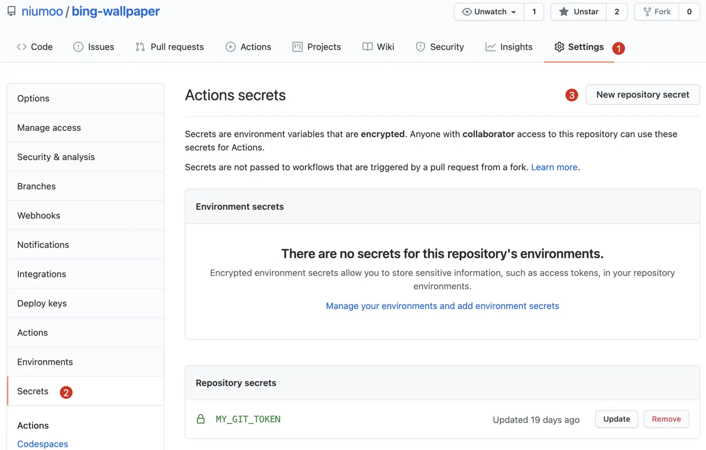

# [如何使用 Github Actions 自动抓取每日必应壁纸?](https://my.oschina.net/niumoo/blog/4968554)

如何白嫖 Github 服务器自动抓取必应搜索的每日壁纸呢？

如果你访问过[必应搜索](https://www.oschina.net/action/GoToLink?url=https%3A%2F%2Fcn.bing.com%2F)网站，那么你一定会被搜索页面的壁纸吸引，必应搜索的壁纸每日不同，自动更换，十分精美。这篇文章会介绍如何一步步分析出必应搜索壁纸 API ，如何结合 **Github Actions**自动抓取每日必应壁纸到 Github 仓库。

元宵节当天具有中国元素的必应搜索。


<!-- more -->

平常一天的必应搜索。


## 分析必应壁纸 API

既然是网站上的背景，又是每天更换，很大概率是通过某个 API 请求返回壁纸信息的，事实真是如此吗？直接打开浏览器 network 控制台监控网络请求信息。


筛选 XHR 异步请求，排除 js 文件加载请求后，在一个路径为 `HPImageArchive.aspx` 的请求中，发现响应的信息似乎和背景图片有关，直接复制出请求的 URL ，得到了一个似乎是壁纸 API 的接口。

```SHELL
https://cn.bing.com/HPImageArchive.aspx?format=js&amp;idx=0&amp;n=1&amp;nc=1614319565639&amp;pid=hp&amp;FORM=BEHPTB&amp;uhd=1&amp;uhdwidth=3840&amp;uhdheight=2160
```

这个接口返回的信息到底是不是页面上的图片信息呢？还需要进一步测试，单独请求分析这个接口，分析其中的响应信息。

```json
➜  ~ curl https://cn.bing.com/HPImageArchive.aspx?format=js&amp;idx=0&amp;n=1&amp;nc=1614319565639&amp;pid=hp&amp;FORM=BEHPTB&amp;uhd=1&amp;uhdwidth=3840&amp;uhdheight=2160
{
  "images": [
    {
      "startdate": "20210225",
      "fullstartdate": "202102251600",
      "enddate": "20210226",
      "url": "/th?id=OHR.JinliStreet_ZH-CN3020276206_UHD.jpg&amp;rf=LaDigue_UHD.jpg&amp;pid=hp&amp;w=3840&amp;h=2160&amp;rs=1&amp;c=4",
      "urlbase": "/th?id=OHR.JinliStreet_ZH-CN3020276206",
      "copyright": "挂在锦里街上的红灯笼，中国成都 (© Philippe LEJEANVRE/Getty Images)",
      "copyrightlink": "/search?q=%e9%94%a6%e9%87%8c%e8%a1%97&amp;form=hpcapt&amp;mkt=zh-cn",
      "title": "",
      "quiz": "/search?q=Bing+homepage+quiz&amp;filters=WQOskey:%22HPQuiz_20210225_JinliStreet%22&amp;FORM=HPQUIZ",
      "wp": true,
      "hsh": "e9b5fb1ad61034342e8d459bff8fc5c5",
      "drk": 1,
      "top": 1,
      "bot": 1,
      "hs": []
    }
  ],
  "tooltips": {
    "loading": "正在加载...",
    "previous": "上一个图像",
    "next": "下一个图像",
    "walle": "此图片不能下载用作壁纸。",
    "walls": "下载今日美图。仅限用作桌面壁纸。"
  }
}
➜  ~
```

可以看到返回的结果中有 `URL` 信息，拼接到必应网址访问测试（其实通过响应信息里的图片描述 ”挂在锦里街上的红灯笼，中国成都“ 就已经猜到大概率是了，今日元宵节）。

```shell
https://bing.com/th?id=OHR.JinliStreet_ZH-CN3020276206_UHD.jpg&amp;rf=LaDigue_UHD.jpg&amp;pid=hp&amp;w=3840&amp;h=2160&amp;rs=1&amp;c=4
```

访问后发现就是必应搜索网站的当日壁纸（元宵节必应放了一张红色灯笼壁纸）。


到这里，我们已经找到了必应搜索壁纸的 API 接口和响应信息中的图片地址。如果再看图片的 URL 地址，其中携带了不少参数，这些参数是什么意思呢？可以大胆猜测，其中的参数 `w=3840&h=2160` 应该是指图片的宽和高，确实是这样，调整这两个参数可以返回不同分辨率的图片，如果没有这两个参数就可以返回超清原图。

## 必应壁纸爬虫

上面分析出了必应壁纸的 API ，那么就不难写一个自动爬取当天必应壁纸的自动化程序。

1. 请求必应壁纸 API。
2. JSON 解析出图片 URL。

这里网络请求使用 Java 原生写法，JSON 解析使用了 FASTJSON ，代码简单直接放上来了。

```java
/**
 * <p>
 * 网络请求操作工具类
 *
 * @author niujinpeng
 * @link https://github.com/niumoo
 */
public class HttpUtls {

    /**
     * 获取 HTTP 连接
     *
     * @param url
     * @return
     * @throws IOException
     */
    public static HttpURLConnection getHttpUrlConnection(String url) throws IOException {
        URL httpUrl = new URL(url);
        HttpURLConnection httpConnection = (HttpURLConnection)httpUrl.openConnection();
        httpConnection.setRequestProperty("User-Agent", "Mozilla/5.0 (Windows NT 10.0; Win64; x64) AppleWebKit/537.36 (KHTML, like Gecko) Chrome/83.0.4103.116 Safari/537.36");
        return httpConnection;
    }

    /**
     * 请求指定 URL 的内容
     *
     * @param url
     * @return
     * @throws IOException
     */
    public static String getHttpContent(String url) throws IOException {
        HttpURLConnection httpUrlConnection = getHttpUrlConnection(url);
        StringBuilder stringBuilder = new StringBuilder();
        // 获得输入流
        try (InputStream input = httpUrlConnection.getInputStream(); BufferedInputStream bis = new BufferedInputStream(
            input);) {
            byte[] buffer = new byte[1024];
            int len = -1;
            // 读到文件末尾则返回-1
            while ((len = bis.read(buffer)) != -1) {
                stringBuilder.append(new String(buffer, 0, len));
            }
        } catch (Exception e) {
            e.printStackTrace();
        } finally {
            httpUrlConnection.disconnect();
        }
        return stringBuilder.toString();
    }

}
```

如果觉得 Java 原生网络请求写法繁琐，也可以使用 OkHTTP 进行请求。请求到响应结果之后，使用 FASTJSON 解析响应的结果。

```java
/**
 * @author niujinpeng
 * @link https://github.com/niumoo
 */
public class Wallpaper {

    // BING API
    private static String BING_API = "https://cn.bing.com/HPImageArchive.aspx?format=js&amp;idx=0&amp;n=1&amp;nc=1612409408851&amp;pid=hp&amp;FORM=BEHPTB&amp;uhd=1&amp;uhdwidth=3840&amp;uhdheight=2160";

    private static String BING_URL = "https://cn.bing.com";

    public static void main(String[] args) throws IOException {
        String httpContent = HttpUtls.getHttpContent(BING_API);
        JSONObject jsonObject = JSON.parseObject(httpContent);
        JSONArray jsonArray = jsonObject.getJSONArray("images");

        // 图片地址
        String url = BING_URL + (String)jsonArray.getJSONObject(0).get("url");
        url = url.substring(0, url.indexOf("&amp;"));

        // 图片时间
        String enddate = (String)jsonArray.getJSONObject(0).get("enddate");

        // 图片版权
        String copyright = (String)jsonArray.getJSONObject(0).get("copyright");

        // 格式化为 MD 格式
        String text = String.format("%s | [%s](%s) ", enddate, copyright, url) + System.lineSeparator();
        System.out.println(text);
      
        // 写入 MD 文件
        Path path = Paths.get("README.md");
        if (!Files.exists(path)) {
            Files.createFile(path);
        }
        List<string> allLines = Files.readAllLines(path);
        allLines.set(0, text);
        Files.write(path, "## Bing Wallpaper".getBytes());
        Files.write(path, System.lineSeparator().getBytes(), StandardOpenOption.APPEND);
        Files.write(path, allLines, StandardOpenOption.APPEND);
    }
}
```

运行之后就可以得到必应网站当天的壁纸信息。

```
20210226 | [挂在锦里街上的红灯笼，中国成都 (© Philippe LEJEANVRE/Getty Images)](https://cn.bing.com/th?id=OHR.JinliStreet_ZH-CN3020276206_UHD.jpg) 
```

## Github Actions

如果我们想要收集每天的必应壁纸，岂不是每天都要运行一次爬虫程序？这显然太麻烦了。如果有个定时任务每天自动执行一次，岂不妙哉？但是挂在服务器上还需要购买一台虚拟主机，实在得不偿失。

这时机智的我突然想到何不利用 **Github Actions** 功能呢？**Github Actions** 可以执行多种常见环境的程序，而且可以定时触发，免费好用，实在是妙，心中默默的也为微软竖起了大拇指。


下面会简单介绍一下 **Github Actions** 的使用，更多的关于 **Github Actions** 的概念和使用的场景就不介绍了，我们只要知道利用 **Github Actions** 功能，可以让我们在指定的**事件触发**（代码提交事件或者**定时**或者其他）时，可以运行指定的程序就好了。

如果想了解更多的相关资料，可以直接参考[ Github Actions 官方文档](https://www.oschina.net/action/GoToLink?url=https%3A%2F%2Fdocs.github.com%2Fen%2Factions%2Fquickstart)，也可以参考其他的相关中文教程，链接这里已经放在文章末尾了。

### **Github Actions 体验**

在 Github 仓库页面的 Actions 页签下可以创建 Github Actions 配置，这里创建一个官方提供的简单示例进行演示。


创建后可以得到一个官方编写好的 Actions Demo，功能就是输出几个字符串。


简单介绍一下图中 Actions 配置文件中的的一些概念。

1. `on` 指定此 Actions 的触发机制，这里的 `push` 和 `pull_request` 说明在代码提交和代码合并时会触发。
2. `jobs` 代表一个任务，一个 Actions workflows 可以有多个 `jobs` 构成。
3. `runs-on` 指定运行 Actions 的系统环境，这里是 `ubuntu`.
4. `steps` 代表当前 `jobs` 任务的执行步骤。示例里先检出了仓库，然后`echo` 了几个字符串。

保存提交这个文件到仓库，因为配置里配置了触发机制有 `push`，所以这时也会触发这个任务。


## Github Actions 定时抓取必应壁纸

已经简单体验了 Github Actions 的使用方式，还记得我们上面编写了一个简单的必应壁纸 Java 版爬虫吗？如果我们把爬虫代码提交到仓库，然后使用 Github Actions 功能定时检出仓库运行 Java 代码抓取壁纸，再写入壁纸到仓库，一套下来无服务器零成本岂不是很好？

先直接附上写好的 Github 仓库地址：[https://github.com/niumoo/bing-wallpaper](https://www.oschina.net/action/GoToLink?url=https%3A%2F%2Fgithub.com%2Fniumoo%2Fbing-wallpaper) ，已经可以每天自动抓取当天必应壁纸。

下面是关于 Actions 内容的一些说明。

```yml
# This workflow will build a Java project with Maven
# For more information see: https://help.github.com/actions/language-and-framework-guides/building-and-testing-java-with-maven

name: Java CI with Maven
on:
  schedule:
    # 定时执行，Runs at 17:00 UTC every day
    - cron:  '0 17 * * *'
    
jobs:
  build:
    runs-on: ubuntu-latest
    steps:
    - uses: actions/checkout@v2
    - name: Set up JDK 1.8
      uses: actions/setup-java@v1
      with:
        java-version: 1.8
    - name: Build with Maven
      run: mvn -B package --file pom.xml
    - name: Run Java Application
      run: java -jar target/bing-wallpaper-jar-with-dependencies.jar
    - name: Commit files
      run: |
         git config --local user.email "your_github_email@126.com"
         git config --local user.name "your_github_name"
         git add README.md
         git commit -m "update readme.md"
    - name: Push changes
      uses:  ad-m/github-push-action@master
      with:
         github_token: ${{ secrets.MY_GIT_TOKEN }}
         branch: main
```

配置中定时在每天 UTC 时间 17 点运行一次，从 `steps` 可以看到执行步骤。

1. 检出代码。
2. 设置 Java 环境为 JDK 1.8.
3. maven 编译打包。
4. 运行打包后的 Java 程序（程序中把获取到的壁纸写入到了 README.md 文件）。
5. 提交文件到 Github 仓库。

配置中最后还使用了一个参数 `{{ secrets.MY_GIT_TOKEN }}` ,这是一个用于识别是否有提交 Github权限的密文，这个密文可以在 Github 网站 -> 点击头像 -> Settings -> Developer settings -> Personal access tokens 这里创建，或者直接访问 [https://github.com/settings/tokens/new](https://www.oschina.net/action/GoToLink?url=https%3A%2F%2Fgithub.com%2Fsettings%2Ftokens%2Fnew) 创建，创建时勾选 `repo` 权限。保存后可以得到你的密文。


复制这串密文，配置到自己创建 Actions 的仓库。



至此，仓库和配置都已经完成，每天自动抓取必应首页壁纸写入到 README.md 文件，下图是抓取的效果。


Github 仓库地址：[https://github.com/niumoo/bing-wallpaper](https://www.oschina.net/action/GoToLink?url=https%3A%2F%2Fgithub.com%2Fniumoo%2Fbing-wallpaper) 。

## 参考

[1] [https://docs.github.com/en/actions/quickstart](https://www.oschina.net/action/GoToLink?url=https%3A%2F%2Fdocs.github.com%2Fen%2Factions%2Fquickstart)

[2] [https://github.com/niumoo/bing-wallpaper](https://www.oschina.net/action/GoToLink?url=https%3A%2F%2Fgithub.com%2Fniumoo%2Fbing-wallpaper)

## 订阅

\> 文章已经收录到 [github.com/niumoo/javaNotes](https://www.oschina.net/action/GoToLink?url=https%3A%2F%2Fgithub.com%2Fniumoo%2FjavaNotes)

可以关注[未读代码博客](https://www.oschina.net/action/GoToLink?url=https%3A%2F%2Fwww.wdbyte.com)或者微信搜索「 **未读代码** 」。

文章会在博客和公众号同步更新。