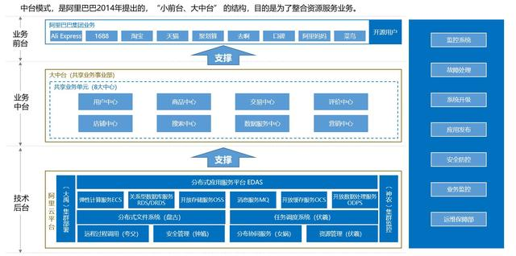
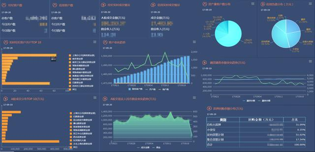
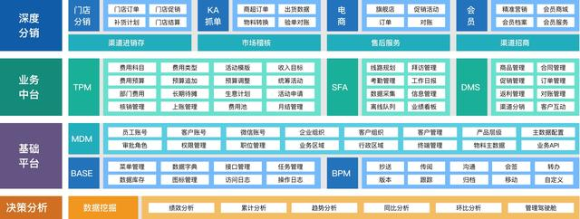
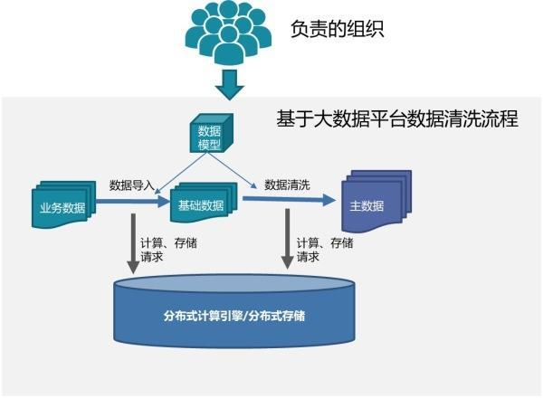
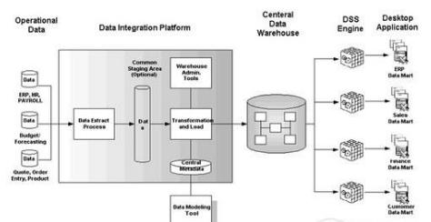
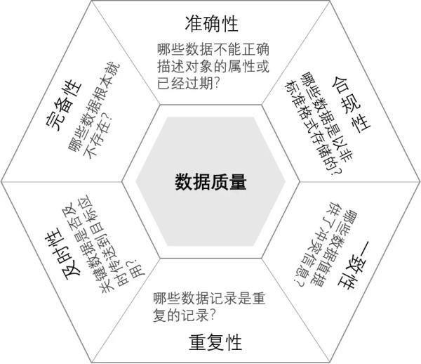
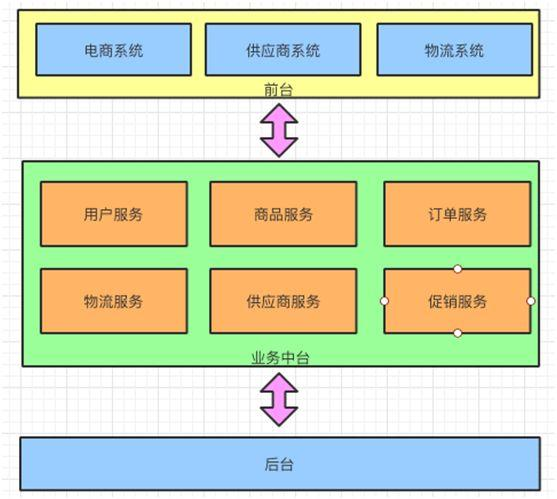

# 数据中台到底是什么样的

现在关于数据中台的解释很多了，当然各有道理，但如果我问你数据中台与数据仓库、数据平台、数据湖等有什么本质区别，你不一定说得清楚。

比如我们引入的某大厂的ETL工具BDI，你认为其是数据中台一部分吗？

我可以明确的告诉你，它刚出来的时候根本不能算是中台的东西，它只是一个偏系统级的应用。

**为什么？**

在之前，笔者先给大家看一封很久很久以前一位同事的离职信，上面是这么说的：

“非常感谢周五下午您的那次促膝长谈和写给我的两封信（一定花了您不少时间！）。这两天认真考虑了您给我的建议，并与身边好友以及XX的同学交流了看法，特别是征求了家人的建议，最终我还是决定离开。主要基于如下考虑：

工作对于我来说，最大的成就感就在于能发挥自己的专长并因此创造价值，影响决策者，在这点上，XX企业的目前的职位更为明晰一点。在传统行业，还是以业务部门为绝对主导，他们有大量和决策层接触的机会，例如......分析报告，无论是主动还是被动，他们都得到了大量的锻炼机会，并可以自由在报告中表达自己的观点、想法，影响决策者......”

这封信反映了一名数据技术从业者的困惑。

“一直以来，企业的BI数据管理跟IT是紧捆绑的，但跟公司的战略、业务脱节非常厉害，很多企业几乎没有想过企业获取利润跟数据管理有多少直接的关系，反正是大概有关系吧。企业有投资，有费用，反正属于IT要干的事就去干吧，大家都在做，我们当然也要做，在我刚开始做元数据管理的时候，就是这个感觉，从没想到这个东西跟企业的利润有半毛钱关系。”

“做了怎么样？不做了又怎么样？我们甚至连自己都骗不过。直到开始做大数据，当商务、开发必须紧密衔接的时候，当发现某个数据问题已经导致变现困难的时候，才感觉到数据管理的真正价值，才知道自己的数据管理工作该干什么。”

**这是我以前的困惑。**

自己不止一次的提到过：IT是业务的后端，而数据是后端的后端，数据要往前走面临着巨大挑战。DT时代给了我们一次机会，但有了势，没有方法和举措，你也抓不住，还好，我们有数据中台为自己正名。

但十多年前数据仓库如火如荼兴起的时候，为什么它就不能称为数据中台？为什么数据仓库就不能更好的创造价值？

笔者认为数据中台起码有三个特征，是传统的数据平台很难兼顾的：**业务化、服务化及开放化**。**业务是根本，服务是手段，开放是价值，而数据中台把三个都占全了**。

## 一、业务化

**数据仓库是数据中台吗？**

**不是，因为数据仓库只是实现了数据的平台化，那么，平台化又是什么意思呢？**

举个例子，我们拿一个饮料厂的产品线来讲，他可以生产果汁，还可以生产其他的产品，从原材料加工成饮料，它有很多环节，虽然品种不一样，但是它很多环节是类似的，比如装瓶、搅拌。

那么这几个不同的生产流程、生产线，我们可以把那些公共的部分合并起来，更加专业化，然后并且让他们独立去维护，之后把那些不同的产品面向客户，使客户体验不同的产品，使它独立出来，这就是平台化的思路。

所以，平台化的思路很重要的就是把那些有共性的资源，有共性的能力合并在一起，然后把那些面向客户的价值独立出来，这样的话，专业的人做专业的事情，并且对于企业的绩效也非常的有利，不揉在一块了，更加的清晰，这就是平台化的思路。

数据仓库也有一样，各方的数据资源通过E汇聚在一起，然后通过T统一做转化，再通过L统一入库再通过DW分层处理建模，最终实现数据的共享，整个过程就是柔性数据处理"流水线"，从而满足不断丰富、变化的数据分析、挖掘类需求，有时我们也把数据仓库叫做数据仓库平台。

**但数据仓库也好，传统的数据平台也好，其出发点应该说更是一个支撑性的技术系统，即一定要去考虑我有什么数据，然后我才能干什么，因此特别强调数据质量和元数据管理，而数据中台的第一出发点可不是数据，而是业务，一开始不用看你系统里面有什么数据，而是去解决你的业务问题需要什么样的数据服务？**

笔者以下的实践完美的诠释了以上观点。

一般来讲数据采集在一个企业是由统一的采集运维团队负责的，但你会发现一些数据的采集和解析方式直接决定了业务的价值，而这对于一般的采集运维团队来说是非常困难的。

比如对于位置数据，笔者就要求打破层级式的数据管理方式，让位置洞察团队直接端到端的完成从业务到数据采集的全过程，位置洞察团队实际承担着位置产品研发、行业模型研发、位置精度算法、位置数据解析和采集等多种职能，因为只有他们才能理解清楚如何根据业务要求来采集全自己所需的数据，从而让上层应用达到业务的要求。

**你看，这就叫业务化，用业务驱动数据的建设，这是数据中台希望达到的目标。**

我们也可以反思，为什么以前大而全的数据治理项目会经常失败？因为它源于数据，终于数据，它竟然是自我循环的。

为什么公司会限制大数据的投资？因为看不到明显的业务产出，因为没有人为你的数据平台建设背书。

数据中台区别于传统数据平台的在于数据中台的思维是业务化的思维，它从业务问题出发。这也能解释为什么业务部门对数据中台是比较欢迎的，哪怕我的数据只有50%的准确性，只要能产生价值，何必纠结于50%？

## 二、服务化

**大家在提数据中台的时候，服务化应是提得最多的，因为服务化自带共享，可编排等中台核心的特征。**

很多时候我们会发现不同的应用开发项目组，他们都会调用同样的数据模型，但是由于不了解数据，也不知道底层的数据结构，所以不同的项目组可能对同样的数据会用不同的处理方法，然后出来的结果不一样。有的是错误的，所以开发速度慢，并且数据结果不准确，质量低，这就是过去应用开发和数据开发所面临的矛盾。

但是现在数据中台就要解决这个问题，数据中台要把那些能复用的数据模型，变成一个数据的能力平台，让那些做数据的人专注在做数据，把数据变成一个乐高积木，数据服务提供给应用开发，然后不同的应用开发项目组可以共同的去调用唯一的数据服务，从而保证数据质量和一致性，加速从数据到价值的转换过程。

**关于服务化的形式，有些人认为只有封装成API才算是，我觉得不是，因为数据跟功能不同，其分析的灵活性和数据维度的无限性决定了你不可能封装出所有的数据服务，因此这里的服务应该是广义的服务，只要我提供的数据能够被共享使用，在前端被业务人员或者其他机器快速方便的使用或调用，这就是数据的服务化。**

广义的数据服务有三种服务的方式：

**1、数据模型**

数据模型是广义数据服务的基础，按照数据仓库的模型分层概念，**第一种是基础模型**，主要实现数据的标准化，我们叫作“书同文、车同轨”，**第二种是融合模型**，主要实现跨越数据的整合，整合的形式可以是汇总、关联，也包括解析，**第三种是挖掘模型**，虽然是偏应用的，但模型具有共性的话就需要把它归属到中台模型，以便开放给其它人使用，中台模型的中是相对的，没有绝对的标准。

**2、数据服务**

将数据模型按照应用要求做了服务封装，比如API，所谓的狭义的数据服务，其更多强调的是机器与机器的接口，就是我的数据分析或挖掘出来的结果，不仅仅以报表可视化的形式让人看，而更多的是把这些API数据服务直接地嵌入到生产系统里面产生影响，变成你的价格策略，推荐引擎或者风险管控。

为什么我前面说初期版本的BDI采集工具不是一个数据中台的东西，因为它只提供僵死的界面，不提供API等任何接口，它是一个纯粹的应用。

**3、数据开发**

但有数据模型和数据服务还是远远不够的，因为再好的现成数据和服务也往往无法满足前端个性化的要求，这时候就得授人以鱼不如授人以渔了，广义的数据服务的最后一种服务形式就是数据开发和探索，其按照开发难度也分为三个层次：

最简单的是提供标签库（DMP），用户可以基于标签的组装快速形成客户群，一般面向业务人员。

其次是提供数据开发平台，用户可以基于该平台访问到所有的数据并进行可视化开发，一般面向SQL开发人员。

最后就是提供应用环境和组件，让技术人员可以自主打造个性化数据产品，以上层层递进，满足不同层次人员的要求。

**但你也需要知道，光有服务化不能成就数据中台，它只是数据中台的必要条件而已，而业务化是前提。**

## 三、开放化

**那么有了业务化、服务化特征的数据平台总是数据中台了吧？**

**概念上讲是，但追求形式没意义，关键还要看数据中台的开放能力，这个决定了它能创造的最终价值。**

**1、开放意味着知道**

数据中台要发挥出价值，光有能力不够，你必须通过各种手段告知别人你有这种能力，2016年我们就完成了大数据平台的建设，该采集的数据也采了，该提供的服务也提供了，但当时最大的挑战是如何让人家知道你有哪些数据，数据怎么访问，有什么价值，直到现在这个问题还存在，即使千人计划已经实施了多年。

**2、开放意味着好用**

数据中台由于直接为前端服务，对于体验的要求特别高，比如你让人家查询到了某个标签，但由于这个标签解释性差就放弃了，最近我们启动的标签治理工作就是要解决好这类问题，数据做到最后都是细微之处见真功夫。

我们提供了不少开放平台，比如数据开发平台、敏捷挖掘平台等等，但以前就是不好用啊，你的数据操作体验不如PL/DEV，人家就不会用，你不支持存储过程，人家也不会用，敏捷挖掘的性能不够，人家也会抱怨，数据开放平台的成长史就是一部项目经理、产品经理的血泪史。

**3、开放意味着迭代**

你敢于开放数据中台，就意味着要以谦卑的心态去接受批评并不断迭代提升，它不仅仅是说我产生完数据或产品就完事了，而是所有数据或产品的都要持续的去运营，运营的目的就是去看我提供的数据或产品服务是有谁在用，用的情况如何，产生了多少收入，从而给出提升的方法，如此循环，你的数据中台的价值才会越来越大。

迭代还意味着很多数据中台需要结合企业实际进行定制化，因为你没有现成的产品可买，诸如数据管理等大量功能都需要定制化，数据中台定制化的比例估计超过7成，意味着你很少能找到其他行业的最佳实践为你所用。

**笔者所以提业务化、服务化、开放化是数据中台的特征，目的还是希望能澄清概念，提供一个较为中肯的衡量数据中台的方法，不是任何一个数据平台或组件都可以称之为数据中台的，在数据中台未达到预期前，先想想有哪些要素我是没做到的。**