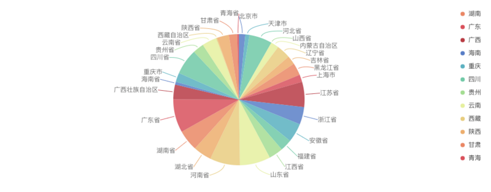

# [数据可视化入门指南](https://segmentfault.com/a/1190000019934874)

作者：董晓庆 蚂蚁金服体验技术部

这是一篇给大家提供数据可视化开发的入门指南，介绍了可视化要解决的问题和可以直接使用的工具，我将从下面几个方面给大家介绍，同时以阿里/蚂蚁的可视化团队和资源举例说明：

- 什么是数据可视化？
- 怎样进行数据可视化？
- 数据可视化的场景和工具
- 数据可视化过程中常见的问题

## 什么是数据可视化

数据可视化研究的是，如何将数据转化成为交互的图形或图像等，以视觉可以感受的方式表达，增强人的认知能力，达到发现、解释、分析、探索、决策和学习的目的。

> 数据可视化（Data Visualization）和信息可视化（Infographics）是两个相近的专业领域名词。狭义上的数据可视化指的是数据用统计图表方式呈现，而信息可视化则是将非数字的信息进行可视化。前者用于传递信息，后者用于表现抽象或复杂的概念、技术和信息。而广义上的数据可视化则是数据可视化、信息可视化以及科学可视化等等多个领域的统称。
> ——《[数据可视化之美](http://www.ituring.com.cn/article/9967)》

广义的数据可视化涉及信息技术、自然科学、统计分析、图形学、交互、地理信息等多种学科。

> 科学可视化（Scientific Visualization）、信息可视化（Information Visualization）和可视分析学（Visual Analytics）三个学科方向通常被看成可视化的三个主要分支。这三个分支整合在一起形成的新学科“数据可视化”，是可视化研究领域的新起点。
> ——《[数据可视化](http://item.jd.com/11349429.html)》

下面我们对科学可视化、信息可视化和可视分析学做简单的介绍：

### 科学可视化

科学可视化（Scientific Visualization）是可视化领域最早、最成熟的一个跨学科研究与应用领域。面向的领域主要是自然科学，如物理、化学、气象气候、航空航天、医学、生物学等各个学科，这些学科通常需要对数据和模型进行解释、操作与处理，旨在寻找其中的模式、特点、关系以及异常情况。

### 信息可视化

信息可视化（Information Visualization）处理的对象是抽象数据集合，起源于统计图形学，又与信息图形、视觉设计等现代技术相关。其表现形式通常在二维空间，因此关键问题是在有限的展现空间中以直观的方式传达大量的抽象信息。与科学可视化相比，科学可视化处理的数据具有天然几何结构（如磁感线、流体分布等），信息可视化更关注抽象、高维数据。柱状图、趋势图、流程图、树状图等，都属于信息可视化最常用的可视表达，这些图形的设计都将抽象的数据概念转化成为可视化信息。

### 可视分析学

可视分析学（Visual Analytics）被定义为一门以可视交互为基础的分析推理科学。它综合了图形学、数据挖掘和人机交互等技术，以可视交互界面为通道，将人感知和认知能力以可视的方式融入数据处理过程，形成人脑智能和机器智能优势互补和相互提升，建立螺旋式信息交流与知识提炼途径，完成有效的分析推理和决策。

科学可视化、信息可视化与可视分析学，这三者有一些重叠的目标和技术，这些领域之间的边界尚未有明确的共识。

### 数据可视化的目标

数据可视化的本质是将数据通过各种视觉通道映射成图形，可以使得用户更快、更准确的理解数据。因此数据可视化要解决的问题是如何将数据通过视觉可观测的方式表达出来，同时需要考虑美观、可理解性，需要解决在展示的空间（画布）有限的情况下覆盖、杂乱、冲突等问题，再以交互的形式查看数据的细节。

## 怎样进行数据可视化

用一张经典的图来说明如何进行数据可视化：

数据可视化过程可以分为下面几个步骤：

1. 定义要解决问题
2. 确定要展示的数据和数据结构
3. 确定要展示的数据的维度（字段）
4. 确定使用的图表类型
5. 确定图表的交互

### 定义问题

首先明确数据可视化是要让用户看懂数据，理解数据。所以开始数据可视化前一定要定义通要解决的问题。例如：我想看过去两周销售额的变化，是增长了还是下跌了，什么原因导致的？
你可以从 趋势、对比、分布、流程、时序、空间、关联性等角度来定义自己要解决的问题。

### 确定要展示的数据

进行数据可视化首先要有数据，由于画布大小的限制，过量的数据不能够在直接显示出来，所以要确定展示的数据：

- 我要展示的数据是否已经加工好，是否存在空值？
- 是列表数据还是树形数据？
- 数据的规模有多大？
- 是否要对数据进行聚合，是否要分层展示数据？
- 如何加载到页面，是否需要在前端对数据处理？

### 确定要显示的数据维度

进行可视化时要对字段进行选择，选择不同的字段在后面环节中选择适合的图表类型也不同。

### 确定使用的图表类型

有非常多的图表类型可以使用，但是要根据要解决的问题、数据的结构、选择的数据维度来确定要显示的图表类型：

如何选择图表类型可以参考：

- AntV 图表用法 ：https://antvis.github.io/vis/doc/chart/classify/compare.html
- 图表使用指引：https://www.yuque.com/mo-college/chart-usage

## 数据可视化的场景和工具

目前互联网公司通常有这么几大类的可视化需求：

- 通用报表
- 移动端图表
- 大屏可视化
- 图编辑&图分析
- 地理可视化

### 通用报表需求

开发过程中面临的 85% 以上的需求都是通用报表的需求，可以使用一般的图表库来满足日常的开发需求，行业内比较常用的图表库有：Highcharts、Echarts、amCharts 等，AntV 开源了基于图形语法的图表库：[G2](https://github.com/antvis/g2)

[G2](https://antv.alipay.com/zh-cn/g2/3.x/demo/index.html) 具备以下特性：

- 千变万化、自由组合。从数据出发，仅需几行代码就可以轻松获得想要的图表展示效果
- 生动、易实现。大量产品实践之上，提供绘图引擎、完备图形语法、专业设计规范
- 丰富的交互能力。在图形语法的基础上提供了自定义交互的能力

目前阿里集团内部已经有大量基于 G2 封装的图表库，针对特定的框架和业务场景进行了封装，其中部分已开源：

- [bizcharts](https://bizcharts.net/index) 阿里巴巴国际 UED 团队出品，G2 的 react 封装，主打电商业务图表可视化，沉淀电商业务线的可视化规范。在 React 项目中实现常见图表和自定义图表。
- [viser](https://viserjs.github.io/) 阿里数据平台技术部出品，支持 vue, react，angularjs 三个框架。

### 移动端可视化

如果你面临的场景需要 PC 端和移动端都兼容那么使用 G2 然后适配移动端的屏幕即可，但是如果你在移动 APP 上使用 H5 或者小程序开发，那么就选择 [F2](https://github.com/antvis/f2)

F2是一个专注于移动，开箱即用的可视化解决方案，完美支持 H5 环境同时兼容多种环境（node, 小程序，weex）。完备的图形语法理论，满足你的各种可视化需求。专业的移动设计指引为你带来最佳的移动端图表体验。

F2 对多个平台提供支持，阿里集团的其他团队也做了一些封装，比如my-f2，这是针对小程序封装的版本，目前已开源：

https://github.com/antvis/my-f2

### 大屏可视化

大屏可视化聚焦于会议展览、业务监控、风险预警、地理信息分析等多种业务的展示，在图形渲染、可视化设计方面都有很高的要求，目前阿里集团内部的大屏可视化团队包括：

- 蚂蚁金服的图形与艺术实验室
- 阿里云的 DataV 团队
- 阿里数据技术及产品部-数据之美

大屏目前几乎已成为to B项目的标配，应用场景越来越广泛。

### 图编辑 & 图分析

图可视化主要有两个大的领域：

- 图编辑：用于图建模（ER图、UML图）、流程图、脑图等，需要用户深入参与关系的创建、编辑和删除的场景
- 图分析：用于风控、安全、营销场景中的关系发现，对图的一些基本概念进行业务上解读，环、关键链路、连通量等。

目前主流的开源框架有：

- [jointjs](https://www.jointjs.com/) 聚焦于图编辑，包含了常见的流程图和BPMN 图的功能，上手容易，开箱即用但是二次开发非常困难。
- [d3.js](https://d3js.org/) 非常底层的可视化库，有大量图分析场景的案例，上手成本高，demo 同业务的距离比较大。

目前 AntV 在图可视化方向开源了 图基础框架 [G6](https://github.com/antvis/g6)

主要完成以下功能：

- 节点和边的渲染，包括自定义节点和边
- 事件交互机制，内嵌了大量常见的交互
- 常见的布局，包括树布局和力导布局

在 G6 的上层我们还针对图编辑和图分析提供了 G6-Analyzer 和 G6-Editor.

### 地理可视化

地理数据可视化主要是对空间数据域的可视化，主要有三大领域：

- 信息图：主要用于展示位置相关的报表，信息图，路径变化等等。
- 大屏应用：大屏展示一般以地理数据为载体，如建筑，道路，轨迹等数据可视化。
- 地理分析应用:这类应用往往是海量地理数据的交互分析，用户基于位置的用户推荐，拉新，促活等业务运营系统，或者选址，风险监控等系统。

AntV G2 和[ L7](https://antv.alipay.com/zh-cn/l7/1.x/index.html) 都提供了地理数据可视化的方案，其中：

- G2 提供通用地理数据图表的支持。
- L7 是更加专业的地理数据可视化解决方案，采用WebGL渲染技术，支持海量地理数据可视化分析，支持多线程运算的矢量瓦片方案。能够满足大屏可视化地理分析应用的需求。

阿里集团的其他地理可视化框架包括：

- 高德的 Loca 
- 菜鸟的 鸟图 

## 常见的问题

### 图表误用

图表的误用是最常见的问题，看下下面的一些场景：

例子1：**分类过多的场景。**下图是各个省的人口的占比情况，因为这张图上包含的分类过多，就出现了简介中提到的问题，很难清晰对比各个省份的人口数据占比情况，所以这种情况下，我们推荐使用横向柱状图。

例子2：我们以一个不同游戏类型的销量对比的场景为例，对于表示分类对比的数据时，我们更应该使用柱状图，而不是折线图。

### 移动端和PC端图表

AntV 提供了 G2 和 F2 两个统计图表框架，用户经常会面同时临移动端和 PC 端的业务，这时候会面临两个框架的选择问题。G2 本质上是为了传统的中后台产品设计的图表库，除了一般的报表显示外，还提供了大量的交互有很强的分析能力；而 F2 则专门为移动端开发，最关注的是代码大小、性能、表现力。

所以我们有以下建议：

- 如果你的用户主要来自 PC 端，那么请使用 G2 ，G2 能支持更多的图表类型和交互。
- 如果你在钱包等重型 app 上使用 H5、小程序开发，请使用 F2。我们对移动端的众多平台做了大量兼容性工作。
- 如果你开发的是一个 BI 分析系统，除了报表功能外还需要一定的分析能力请使用 G2。
- 如果你在开发监控等需要联动系统，主要的用户来自 PC 端则使用 G2。
- 如果你开发的是报表系统，主要的用户通过移动端来看图表，那么请使用 F2（PC 端也可以看）。

### 数据量太大怎么办

我们在前端做的可视化，能做的仅仅是小规模数据的可视化，如果你遇到超大规模数据要进行可视化，那么可以选择：

- 数据分层
- 数据聚合
- 数据抽样

## 总结

这是一篇可视化的入门文章，介绍了可视化要解决的问题和可以直接使用的工具，如果你对可视化感兴趣可以关注[墨者学院](https://antv.alipay.com/zh-cn/vis/index.html)