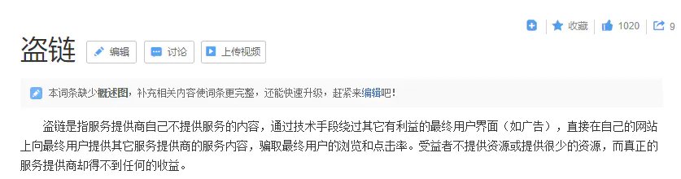
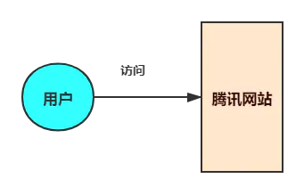

# 网站的防盗链

下午摸鱼的时候遇到了一件有意思的事，在网上找到一个资源站，将资源站的 url 放到自己的博客里，想白嫖一波，结果在我自己的博客里链接失效了，折腾半天忽然想起来，这个网站应该是做了防盗链处理。

### 什么是盗链

`盗链`是个什么操作，看一下百度给出的解释：`盗链`是指服务提供商自己不提供服务的内容，通过技术手段绕过其它有利益的最终用户界面（如广告），直接在自己的网站上向最终用户提供其它服务提供商的服务内容，骗取最终用户的浏览和点击率。受益者不提供资源或提供很少的资源，而真正的服务提供商却得不到任何的收益。术语听得有点迷糊？那我们简单的举个栗子：

平时我们在`TX网`看新闻，里边有很多劲爆的图片、视频资源，每天吸引上亿的用户活跃浏览，赚着大把的广告费。有一天一个穷比程序员小富突发奇想，也想建一个自己的网站吸引用户赚广告费，但苦于自己没有资源，他灵光一闪盯上了`TX网`，心想：要是把它的资源为我所用，这样就能借助TX的资源为自己赚钱。

于是他通过爬虫等一些列技术手段，把`TX网`资源拉取到自己的小富网，绕过了`TX网`的展示页面直接呈现给用户，达到了自己不提供资源又能赚钱的目的。

而如此做法却严重的损害了`TX网`的利益，不仅分流了大量用户，而且由于小富网的大量间接资源请求，大大增加TX网服务器及带宽的压力。

`TX网`蛋糕被动，忍无可忍决定封杀小富网这类空手套白狼的站点，终于祭出防盗链系统，对除了在`TX网`本站以外发起的资源请求全部封杀，小富网没法再拉取资源，小富一下子又成了穷比，嘤嘤嘤~上边我们简单的举例说了什么是网站的盗链，再总结的简单点就是小站点盗取大站点资源以此来获利的一种行为。

既然有人盗就会有人防盗，接下来在看看怎么防止盗链。

### 如何防盗链

防盗链在`google`，`新浪`，`网易`，`天涯`等，内容为主的网站应用的比较多，毕竟主要靠资源内容赚钱的嘛。

在这里插入图片描述

提到防盗链的实现原理得从`HTTP`协议说起，上边我们说过设置防盗链以后，会对 “除了在`TX网`本站以外发起的资源请求全部封杀”，那么问题来了，如何识别一个请求`URL`是从哪个站点发出的呢？

熟悉`HTTP`协议的小伙伴应该知道，在`HTTP`协议头里有一个叫`referer`的字段，通过`referer` 告诉服务器该网页是从哪个页面链接过来的，知道这个就好办了，只要获取 `referer` 字段，一旦检测到来源不是本站即进行阻止或者返回指定的页面。

`防盗链`的核心理念：尽量做到不让外站获取到我的资源，即便能通过一些手段获取到资源，也让你的获取过程异常繁琐复杂，无法实现自动化处理，或者干脆就给你有问题的资源恶心死你。

做`防盗链`的方法比较多，基于`HTTP`协议头的`referer`属性也只是其中一种，下边我们来分析几种实现防盗链的方法，如果你有更好的实现方法欢迎留言哦。

#### 基于 HTTP 协议的 referer

基于`HTTP`协议中的 `referer`做防盗链，可以从网关层或者利用`AOP`、`Filter`拦截器实现。

使用`Nginx`在网关层做防盗链，目前是最简单的方式之一。通过拦截访问资源的请求，`valid_referers` 关键字定义了白名单，校验请求头中`referer`地址是否为本站，如不是本站请求，`rewrite` 转发请求到指定的警告页面。

在 `server` 或者 `location` 配置模块中加入：`valid_referers none blocked`，其中 `none` : 允许没有`http_refer`的请求访问资源（比如：直接在浏览器输入图片网址）；`blocked` : 允许不是`http://`开头的，不带协议的请求访问资源。

**「注意」**：这种实现可以限制大多数普通的非法请求，但不能限制有目的的请求，因为可以通过伪造`referer`信息来绕过。

```
[root@server1 nginx]# vim conf/nginx.conf

      location / {
            root /web;
             index index.html;
      }
      location ~* \.(gif|jpg|png|jpeg)$ {
            root /web;
            valid_referers none blocked www.chengxy-nds.top;
            if ($invalid_referer){
                #return 403;
                rewrite ^/ https://img-blog.csdnimg.cn/20200429152123372.png;
         }
     }

     server {
         listen 80;
         server_name www.chengxy-nds.top;
         location / {
                 root /bbs;
                 index index.html;
         }
    }
    
[root@server1 nginx]# systemctl restart nginx


复制代码
```

`Filter`拦截器的实现方式更加简单，拦截指定请求`URL`，拿到`HttpServletRequest` 中 `referer`值比对是否为本站。

```
public class MyFilter implements Filter {
    @Override
    public void doFilter(HttpServletRequest request, HttpServletResponse response,
            FilterChain chain) throws IOException, ServletException {
            
        HttpServletRequest req = (HttpServletRequest) request;
        HttpServletResponse res = (HttpServletResponse) response;
        String referer = req.getHeader("referer");
        
        if (referer == null || !referer.contains(req.getServerName())) {
            req.getRequestDispatcher("XXX.jpg").forward(req, res);
        } else {
            chain.doFilter(request, response);
        }
    }
}
复制代码
```

#### 登录验证，禁止游客访问

登录验证这种就属于一刀切的方式，一般在论坛、社区类网站使用比较多，不管你发起请求的站点是什么，到我这先登录，没登录请求直接拒绝，简单又粗暴。

#### 图形验证码

图形验证码是一种比较常规的限制办法，比如：下载资源时，必须手动操作验证码，使爬虫工具无法绕过校验，起到保护资源的目的。

实现防盗链的方式还有很多，这里就不一一列举了（别问，问就是还有很多）。

### 总结

本来没想写这篇文章，下午搭建自己的博客整理资料，白嫖别人资源没成功有感而发，哈哈哈~ 正好借此机会简单的介绍一下防盗链的概念，提醒 everyone 在开发中要提高安全意识。其实盗链与防盗链就是像是矛与盾一样，说不好是矛更锋利还是盾更坚固，做不到绝对的防盗。道高一尺魔高一丈，盗链的手段越高，相应的防盗技术也会越成熟。