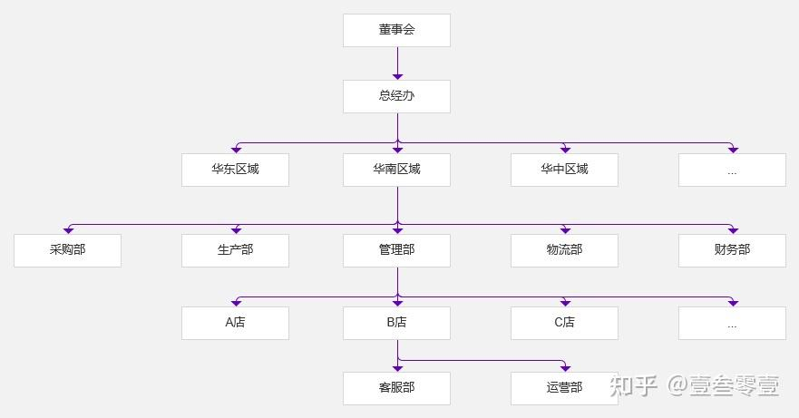

# 软件系统三基座之一：权限管理

何为基座，即是有了这些基础，任一相关的“建筑”就能逐步搭建起来。

## 一、为什么要权限管理

权限管理，一般指根据系统设置的安全规则或者安全策略，用户可以访问而且只能访问自己被授权的资源。只要有用户和密码的系统，几乎全有权限管理。

### 1. 各司其职，提高工作效率

产品经理的品质追求和项目的里程碑交互是矛盾的，让产品经理管项目，可能项目没有终结点。

程序员的逻辑严谨和市场的变化多端是矛盾的，让程序员去做市场销售，可能团队没有太多收益。

#### 2. 权责分明，利于问题溯源

授予管理的权限，同时也是一份责任。费用的报销和预算消耗所剩无几是相关联的，打市场需要团队成员全员硬刚和请假审批松散导致身边无人可用是有前因后果的。

#### 3. 数据隔离，依权限管理数据

市场部的日常执行信息不断反馈给采购部，会极大地消耗采购部的精力。

战略规划部的规划调整随时更新给一线执行人员，会极大地摧毁公司整体的稳固度。

### 4. 安全防患，防止误操作、人为破坏、数据泄漏

某某程序员删库跑路了，某某销售代表携客户资源跳槽了……此类事项屡屡出现，这总是前人血泪教训。

## 二、权限管理

软件系统三基座包含：权限管理、组织架构、用户管理。按照系统管理的设计，交互如下图所示。

以用户管理为例，需要支持最基础的增删改查操作，即是添加用户、编辑用户、删除用户、查询用户。

以现实业务情况，系统用户的增加包含用户注册或管理员添加。对于其他系统用户来讲，用户管理这一块与自己无关，不必查看，就需要做权限管控。

权限管理和现实中的开锁相似。首先需要了解哪些地方需要加锁，公园就不需要加锁，即是**权限点注册**；其次是在需要加锁的地方放上锁，并给需要的人发放钥匙，即是**授权**；最后则是有钥匙的人拿着钥匙开锁，没有钥匙则在封锁区域之外，即是**鉴权**。

**哪些地方加锁 = 权限点注册**

**上锁并发放钥匙 = 授权**

**拿钥匙开锁 = 鉴权**

### 1. 权限点注册

权限点注册是软件哪些功能需要做权限控制，就添加到权限控制的列表中。注册成功后，权限点树形结构展示，如下图所示。

权限点注册支持树形结构，也就是没有授权“用户管理”时，不能授权“删除用户”。权限点还可以细分按钮权限、URL权限，按钮权限控制页面上是否可见，URL权限控制按钮的交互是否能执行。一般的情况下，对同一个操作需要既授予按钮权限，又授予URL权限。若存在系统间接口数据交互的情况，不需要页面交互，就不必授予按钮权限。

权限管理作为底层支持，可扩展更多模块、更多应用的管理。在三基座授权管理的基础上，增加产品管理，则权限点注册后如下图所示。

### 2. 授权管理

授权管理就是针对不同的用户授予不同的权限，也就能让不同的用户看到不同的软件部分。

如图所示，给用户A授权“添加用户、编辑用户、删除用户、查询用户”权限；给用户B授权“查询用户”；两个用户相比较而言，用户B就只能查询用户，相当于获取用户信息，则不能进行用户信息的编辑、修改。

两个用户都没有授权“用户授权”，则两个用户都不能修改用户的权限信息。

用户授权信息均由系统超管员（一般为admin账户）授权分发下来。

用以上含产品管理的系统进行授权管理，则可授权两大类，一类是A：系统管理，有权限管理、角色管理、用户管理权限，适用于人事；一类是B：产品管理员，有产品管理权限，适用于市场部人员。

A 人事：

B 产品管理员：

### 3. 鉴权

鉴权则是应用自己的权限去打开对应的系统功能。如上面授权举例，系统管理员A、产品管理员B则看到不同的系统功能。

系统管理员 A：

产品管理员 B：

## 三、权限管理应用场景

### 1. 人员变动之入职/调岗

在实际业务中，常存在新人入职，或在岗人员调岗的情况。若依旧使用给人员授权的情况，让整个操作变的复杂。 用户直接授权如下图所示：

如图所示，需要新人入职授权，就需要给新人挨个去授权每个功能；需要调岗，就需要先删除原有的所有权限，然后再授予新的权限。

基于系统要能用、好用的原则，增加角色管理，如下图所示：

如图所示，需要新人入职授权，就只需要勾选新人所属的角色；需要调岗，就只需要先去掉原先的角色，勾选上新的角色，整体操作简便更多。

随着人员变多，业务变复杂，系统功能更庞大，权限管理体系还需要调整。如上例，若新人是个特殊人才，除了通有角色的权限，还需要一个单独权限，就需要增加用户直接授权的能力。当然，也可以新建一个单独的角色，只有这一个特殊的权限来实现。这也正体现了现实业务的复杂性，**没有最好的，只有最适合当前业务需要的**。

### 2. 三方应用权限管理

在三基座的基础上，扩展了产品管理，但作为系统，功能远远不够。电商类的需要扩展，商品管理、订单管理、支付管理、活动管理、积分管理等等一系列的功能模块或应用。

权限系统具有以上能力，为系统扩展打好了基础。增加的应用，通过权限点注册，全部纳入权限管理的范围内。若权限系统把权限点注册、权限查询、权限校验开放成为OpenAPI，则能够兼容三方应用的权限管理。

支持三方应用的权限点管理，就能实现三方应用在较小的改造成本下，纳入系统下，为系统的融合扩展提供了支持。

权限点管理：

添加权限点：

# 软件系统三基座之二：组织架构

## 一、组织的来源

组织是由若干个人或群体所组成的、有共同目标和一定边界的社会实体。**组织是为了提升劳动效率而产生的**。

从一个日常案例，讲讲组织是如何提升劳动效率的。

唯美食与美景不可辜负！那街边林林总总的美食店是如何一点点成长起来的呢？

改革春风吹满地，小白怀揣着一手好烙饼手艺下海了。从购买面粉、备好食材、准备炉灶器具、推着小推车就开始走访在大街小巷。这个期间，他一个人完成食材准备、接待顾客、制作烙饼、收钱找零等一系列的操作。偶尔和还能和顾客笑颜调侃两句。

各种业务一肩挑

针对单人，价值产出可以简化表达：**价值产出=劳动力\*劳动效率**。（这是简化表达式，抽取关键因子）在现实的经济活动中，一个人的劳动力提升要来源于能力、技能，这些都存在一定的学习成本，且相对提升较为缓慢。通过多人协同，让人各司其职、各展所长，通过“专业的人办专业的事”来提升效率，从而提升的单个人的价值产出，也就有了组织的形成。**组织是为了提升劳动效率而产生的**。

趁着好时代，把好好手艺，小白借机扶摇直上，盘下了一个店面。店面里里外外，各项事务，小白一个人那指定是完不成，逐渐搭建了自己的班子。

小白当店长

小文别看斯斯文文，沟通交际一把好手，各种信息那是汇在心中，和各个原料提供商那是水乳交融，带着一帮子伙计那是风生水起；小武就不一样了，魁梧黑壮，一手的好刀工，烙饼的手艺一流，还把相关的汤汤水水、小菜瓜果收拾的色香味俱全，手下的小伙子也是创意十足、五门八类；十里八乡都知道，小双温婉贤淑，气质典雅，一句句温言细语温暖人心；客服部的小姑娘们让所有勤劳辛苦的人们体会了家的温馨；十里八乡也人尽皆知，泉泉那小市侩样儿；眼里心里手里全是钱，钻钱眼里了去了，当然却也从未多取一毫，偶尔抹零还让人小有惊喜。

这不世纪难遇的机会，交通大发展，兄弟姐妹们也都独当一面，尤其是研究的几种美食那是冠绝一方。文武双泉几个老伙计也都各自回到自己的家乡，准备让众人的智慧在自己的家乡遍地开花。

开分店

开了多家分店之后，分店整体的价值是更高了，但在各个环节都变相对薄弱了。

小文对厨房一知半解；小武对财务结算七窍通了六窍……

如何才能继续各展所长呢？经过苦思冥想，终于想到把每个人擅长的东西集中起来，更好地解决。

业务急速扩展

小文统管采购部，食材来源各优秀原产地，质量得到更好保证，还能和更多供应商“博弈”；小武统管生产部，所有美食提前加工成半成品，提高了效率，集中了更多优秀人才，也为厨神争霸搭好舞台；小双统管管理部，对所有服务人员进行相关素养培养，并制定更完善的服务流程，客户更加满意；泉泉回归财务部，借用管理店面的经验，分析数据、挖掘数据，不光管好财政，还反向监督其他部门；当然，组织的扩大，还纳入了更多优秀的人才，也因为业务的调整，增设了物流部，向更广阔的世界探索。

协同形成的组织价值为当前所有人员创造的价值之和。“组织价值”相比“单人价值产出”的“价值差”为组织价值溢出：**组织价值溢出=组织总价值产出-额外用工成本-原单人价值产出。**

单人价值产出 需计算当前在组织下的所有 单人价值产出。

**组织价值溢出则为组织产生的意义。**

小白的饭店就从最开始的“1”个店 发展成为“3”个店，基于各店发展的归“0”复盘，再推陈出新，成为“1”个组织。

## 二、组织的管理

组织结构是以职务**范围、责任、权利**三方面，构建起来的动态结构体系。其目的是为了更高效地实现组织战略目标，而进行的职能划分并构建分工协作体系，因此，组织结构需要根据组织重大战略的调整，进行不断修正。

小白饭店的崛起，主要体现上组织的调整和完善中。要在信息系统中支持组织架构的管理，就需要有支持现实业务的能力。

组织架构能力：

1. 部门的管理，包含新增、编辑、删除、查询；其中查询常区分为查询该部门，查询部门及下级部门；
2. 部门的层级调整，创建子部门、调整部门的上级组织；

特别项：

为支持数据统计的合理有效，支持查询历史某个时间点的组织架构模式；（如：华南区域销售一部在6月1号划归华中区管理，在结算一年的销售完成率的时候，销售一部6月份之前的业绩算到华南）

组织架构管理

如图所示，则是小白公司的组织架构初步复刻。初步实现一个区域的管理，然后扩展各个区域。细致上需扩展各个区域的各个店面，完善各个店面的人员，实现整体组织的管理。

新增组织

在组织管理中，可对部门进行编辑修改，以适应系统组织架构对现实业务的支持。

**示例详细字段描述：**

- **组织代码：**必填，字符串，不超过30字符，无默认值，支持大小写字母、下划线、数字，系统内唯一；
- **组织名称：**必填，字符串，不超过30字符，无默认值，支持中文、大小写字母、下划线、数字，当前分支下唯一；

此处设计扩展信息，是预留字段，方便部门后续的扩展。例如，设置该部门为特殊部门，即可添加标签加以区别。

## 三、类组织管理

在系统实现中，存有很多场景，均需要类组织管理。以期达成重点突出、逻辑清晰、层次分明的管理目标。

行政区域管理：省-市-区；

生物分类管理：界门纲目科属种；

另如：资产分类管理，电商产品分类，行业分类，小区物业管理等；

系统实现中常包含：基础数据管理、区域管理、分类管理。

组织架构主要类型包含：直线职能制、事业部制、模拟分权制、项目组、矩阵制、委员会制。多类型组织架构也体现了业务的复杂及组织是为战略服务的。

组织结构是表明组织各部分排列顺序、空间位置、聚散状态、联系方式以及各要素之间相互关系的一种模式，是整个管理系统的“框架”。

在生活里，类组织管理更好用的是构建“**知识树**”，形成自己的知识森林。

一本书，书名就是树根节点，每个章节就是树的主干，通过所有的知识细节构成一棵枝繁叶茂的大树。

一本书的阅读就是将书本信息通过树形结构完成信息点的串联，树形结构辅助分类归纳，发现事务内在的规律，从而更深刻认识事务。“**分类归组+提炼模型+存量收敛”，**帮助我们很快发现事物之间的内部规律。

很多人很多事一叶障目，其主要原因就是不清楚各个组成部分及组成部分之间的关系。一个好的模型或结构可以辅助快速拆解事务组成部分，并摸清各个部分之间的关系。基于某个事物不断重塑模型的过程，对于该事物的认知不断的飞升。明证一个好的模型本身就能够让人看到更多的信息。

思维导图就是一个常用的树状工具之一。

# 软件系统三基座之三：用户管理

基于权限控制、组织搭建，用户可以批量入场。

## 一、用户管理

在系统构建中，权限控制、组织搭建，对于普通用户都是不可见的。

权限控制，在系统搭建时，就会注册好所有的权限点；在系统初始化时，建立好角色和权限关系。组织搭建则一般由人事成员直接按照现行的组织架构新建即可。

基于权限控制、组织架构，可以批量导入现有公司成员，这是To B业务常见的场景。权限中的角色、组织中的各个部门都有其在当前系统中的唯一性，则可以在导入模板中批量完善，一次性导入。

随着公司的发展，人员会存在离职、调岗、新入职等场景，则用户管理需要支持删除、编辑、添加人员的功能。

## 二、登录注册

除开To B业务场景，To C业务场景中，用户更多需要直接注册。需要用户主动选择参与到这个“系统领域”中来，微信需要注册，微信公众号需要注册，知乎需要注册，抖音需要注册……这里也就引入了用户运营的方法，此为后话，当下不表。

在有用户管理的系统中，都需要登录；而需要注册的情况，单个用户注册也只使用一次，使用频率会低很多。登录注册为进入系统的入口，这是系统这个“风景区”的检票口，从而登录注册的功能常合在一起出现，并因为注册使用频次的原因，使得登录默认展示，而注册需要再切换一次。

常见系统登录注册页面设计：

整体交互情况大同小异，但在于具体功能上确有诸多细分，登录注册方式主要包含：账号+密码+验证码、账号+密码+自动登录；手机号+验证码等。设计交互样式如图所示：

- 账号密码登录，需要验证码校验，简单方式实现登录校验，防止恶意操作；
- 账号密码登录，支持自动登录，记录登录信息，减少登录交互频次；
- 手机号验证码登录，便捷、安全用户登录，因需要验证码校验，会增加运营成本；
- 通过密码登录的情况，需要配置找回密码的功能，以防密码记忆错误或忘记密码，实现业务闭环，以防止将用户挡在系统外。

如此，实现整体业务闭环，将更多功能融合在登录注册页面。

- 登录串联注册账号及密码找回，闭环所有用户使用；
- 登录串联注册，因缺少忘记密码的路径，容易将忘记密码的用户挡在系统之外；
- 登录串联不同角色，引导用户成为商家，同一个入口，还带有潜在引导性。

系统页面存有“商家登录”的情况，则是系统需要将用户分类，直接区别多种类型。如“商家登录”则将用户主动区分为商家、普通用户，业务主体也就是普通用户通过系统向商家购买东西。如此情况，商家则必然相对普通用户少很多，“商家登录”的入口则相对减弱。

## 三、设计检查

基于权限管理、组织架构、用户管理，系统基础构建完成，为后续更丰富完善的系统建设提供了基础。无论是电商业务，还是虚拟文化街，还是学校、医院等管理系统，还是OA、SaaS平台，亦或是低代码、无代码平台，都有无限可能。

- 基于三基座，可以搭建内容管理系统，类似知乎、微博、微信公众号；
- 基于三基座，可以搭建销售管理，常见的如CRM商机管理系统；
- 基于三基座，可以搭建产品销售管理，优秀的如电商体系，支持产品管理、订单管理、支付管理、物流管理、仓储管理；
- 基于三基座，可以搭建进销存管理系统，支撑供应链业务；
- 基于三基座，可以搭建数据中台业务，实现数据采集、清洗、统计、分析及可视化；
- 在系统设计落地中，最核心的是业务闭环，完善所有需要的功能，从MVP逐渐完善。在产品设计中也需要从单个场景来补充检核业务功能设计。系统落地页面中，常见的是 列表页 和 详情页。

**列表页检查项**：

**详情页检查项**：

整体产品设计，通过**业务流程+功能流程**，验证整体核心流程；通过**功能+状态**，验证每一个信息实体自身的交互和逻辑；通过**列表+详情交互检查**，验证每个信息实体交互细节；从大的概况，到每个执行细节，都细化下来优化，这样的产品设计，在产品自闭环上，是一定成功的。

系统是为业务服务的，在三基座的基础上，未来搭建系统，要从解决实际业务问题出发，下一站 **业务分析**。

本文由 @壹叁零壹 原创发布于人人都是产品经理。未经许可，禁止转载。